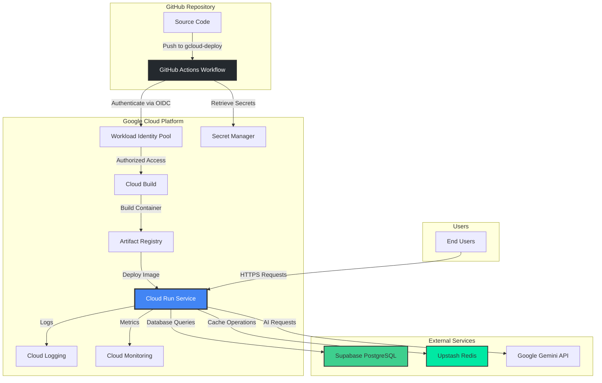

# Design Document: Google Cloud Run Deployment for SafeWallet

## Overview

This design document outlines the technical architecture and implementation strategy for deploying SafeWallet, a Next.js 16 application, to Google Cloud Run as an alternative deployment platform alongside the existing Vercel deployment. The Cloud Run deployment provides containerized hosting with enhanced control over infrastructure, cost optimization through scale-to-zero capabilities, and a multi-cloud strategy for improved resilience.

### Design Goals

1. **Dual Deployment Compatibility**: Maintain identical functionality across both Vercel and Cloud Run platforms without platform-specific code modifications
2. **Cost Optimization**: Leverage Cloud Run's scale-to-zero and request-based pricing to minimize infrastructure costs
3. **Automated CI/CD**: Implement GitHub Actions workflows with Workload Identity Federation for secure, keyless authentication
4. **Infrastructure as Code**: Provide reproducible deployment scripts and configuration files for consistent environment setup
5. **Production-Ready Monitoring**: Configure comprehensive health checks, logging, and observability
6. **Developer Experience**: Create clear documentation and tooling for easy deployment and maintenance

### Key Design Decisions

**Containerization Strategy**: Use the existing multi-stage Dockerfile with Next.js standalone output mode to create optimized container images under 500MB.

**Authentication Method**: Implement Workload Identity Federation instead of service account keys for GitHub Actions authentication, eliminating the security risks associated with long-lived credentials.

**Scaling Configuration**: Configure minimum instances to 0 (scale-to-zero) and maximum instances to 10, with 80 concurrent requests per container to balance cost and performance.

**Health Check Strategy**: Implement a comprehensive `/api/health` endpoint that verifies connectivity to external dependencies (Supabase PostgreSQL, Upstash Redis) before accepting traffic.

**Deployment Trigger**: Use a dedicated `gcloud-deploy` branch to trigger Cloud Run deployments, preventing interference with Vercel's automatic deployments on the main branch.

## Architecture

### High-Level System Architecture



### Component Interaction Flow

**Deployment Flow**:
1. Developer pushes code to `gcloud-deploy` branch
2. GitHub Actions workflow triggers automatically
3. Workflow authenticates to GCP using Workload Identity Federation (OIDC token exchange)
4. Cloud Build builds the Docker container image
5. Image is tagged with git commit SHA and pushed to Artifact Registry
6. Cloud Run deploys the new image revision
7. Health checks verify the new revision before routing traffic
8. If health checks pass, traffic is routed to the new revision
9. Previous revision is retained for rollback capability

**Request Flow**:
1. User sends HTTPS request to Cloud Run service URL
2. Cloud Run routes request to an available container instance (or starts a new one if needed)
3. Next.js server processes the request
4. Application queries Supabase PostgreSQL for data
5. Application checks Upstash Redis for cached data
6. Application may call Google Gemini API for AI features
7. Response is returned to the user
8. Logs are sent to Cloud Logging
9. Metrics are sent to Cloud Monitoring

### Deployment Architecture Comparison

| Aspect | Vercel Deployment | Cloud Run Deployment |
|--------|------------------|---------------------|
| **Hosting Model** | Serverless Functions | Containerized Service |
| **Scaling** | Automatic (per-function) | Automatic (per-container, 0-10 instances) |
| **Cold Start** | ~200-500ms | ~1-2s (container startup) |
| **Build Process** | Vercel Build System | Docker + Cloud Build |
| **Deployment Trigger** | Push to main branch | Push to gcloud-deploy branch |
| **Cost Model** | Per-request + bandwidth | Per-request + CPU/memory time |
| **Configuration** | vercel.json | Cloud Run YAML + gcloud CLI |
| **Monitoring** | Vercel Analytics | Cloud Logging + Cloud Monitoring |
| **Custom Domains** | Automatic HTTPS | Manual DNS + SSL setup |
| **Environment Variables** | Vercel Dashboard | Secret Manager + Cloud Run config |

## Components and Interfaces

### 1. Docker Container

**Purpose**: Package the Next.js application with all dependencies into a portable, reproducible container image.

**Dockerfile Structure** (existing, already optimized):
- **Base Stage**: Node.js 20 Alpine Linux (minimal footprint)
- **Dependencies Stage**: Install production dependencies using `npm ci`
- **Builder Stage**: Build Next.js application with standalone output
- **Runner Stage**: Final production image with non-root user (nextjs:nodejs)

**Key Optimizations**:
- Multi-stage build reduces final image size to <500MB
- Standalone output mode includes only necessary files
- Non-root user improves security posture
- Layer caching optimizes rebuild times

**Interface**:
- **Input**: Source code, package.json, next.config.ts
- **Output**: Container image exposing port 3000
- **Environment Variables**: Injected at runtime by Cloud Run

### 2. Health Check Endpoint

**Purpose**: Provide Cloud Run with a reliable way to determine if the application is healthy and ready to serve traffic.

**Endpoint**: `GET /api/health`

**Response Format**:
```typescript
// Healthy response
{
  "status": "healthy",
  "timestamp": "2026-01-15T10:30:00Z",
  "checks": {
    "database": "connected",
    "redis": "connected"
  }
}
// HTTP 200

// Unhealthy response
{
  "status": "unhealthy",
  "timestamp": "2026-01-15T10:30:00Z",
  "checks": {
    "database": "disconnected",
    "redis": "connected"
  },
  "error": "Database connection failed"
}
// HTTP 503
```

**Health Check Logic**:
1. Verify Supabase PostgreSQL connectivity (simple query: `SELECT 1`)
2. Verify Upstash Redis connectivity (PING command)
3. Return HTTP 200 if all checks pass
4. Return HTTP 503 if any critical dependency fails

**Probe Configuration**:
- **Startup Probe**: Initial health check during container startup (max 240s)
- **Liveness Probe**: Periodic check to detect deadlocks (every 10s)
- **Failure Threshold**: 3 consecutive failures trigger container restart

### 3. GitHub Actions Workflow

**Purpose**: Automate the build and deployment process with secure, keyless authentication.

**Workflow File**: `.github/workflows/gcloud-deploy.yml`

**Trigger Conditions**:
- Push to `gcloud-deploy` branch
- Manual trigger via `workflow_dispatch`

**Workflow Steps**:
1. **Checkout Code**: Clone repository with full git history
2. **Authenticate to GCP**: Use Workload Identity Federation (no service account keys)
3. **Setup Cloud SDK**: Install and configure gcloud CLI
4. **Build Container**: Use Cloud Build to build Docker image
5. **Tag Image**: Tag with git commit SHA for traceability
6. **Push to Registry**: Upload image to Artifact Registry
7. **Deploy to Cloud Run**: Deploy new revision with environment variables
8. **Verify Deployment**: Check service URL and health endpoint
9. **Output Service URL**: Display deployed service URL in workflow logs

**Required GitHub Secrets**:
- `GCP_PROJECT_ID`: Google Cloud project ID
- `GCP_WORKLOAD_IDENTITY_PROVIDER`: Workload Identity Provider resource name
- `GCP_SERVICE_ACCOUNT`: Service account email for Cloud Run deployment
- `SUPABASE_URL`: Supabase project URL
- `SUPABASE_ANON_KEY`: Supabase anonymous key
- `SUPABASE_SERVICE_ROLE_KEY`: Supabase service role key
- `OPENROUTER_API_KEY`: OpenRouter API key for AI features
- `UPSTASH_REDIS_REST_URL`: Upstash Redis REST URL
- `UPSTASH_REDIS_REST_TOKEN`: Upstash Redis REST token
- `SENTRY_DSN` (optional): Sentry DSN for error tracking
- `SENTRY_AUTH_TOKEN` (optional): Sentry authentication token

### 4. Workload Identity Federation

**Purpose**: Enable GitHub Actions to authenticate to Google Cloud without storing long-lived service account keys.

**Architecture**:
- **Identity Pool**: Container for external identity providers
- **Identity Provider**: GitHub OIDC provider configuration
- **Service Account**: GCP service account with Cloud Run deployment permissions
- **Attribute Mapping**: Map GitHub token claims to GCP attributes

**Security Benefits**:
- No service account keys to manage or rotate
- Short-lived tokens (valid for workflow duration only)
- Attribute-based access control (restrict by repository, branch, etc.)
- Audit trail in Cloud Logging

**Setup Requirements**:
1. Create Workload Identity Pool
2. Create Workload Identity Provider for GitHub
3. Create service account with required roles:
   - `roles/run.admin` (deploy Cloud Run services)
   - `roles/iam.serviceAccountUser` (act as service account)
   - `roles/artifactregistry.writer` (push container images)
4. Grant service account access to Workload Identity Pool
5. Configure attribute conditions (e.g., repository name, branch name)

### 5. Cloud Run Service Configuration

**Purpose**: Define the runtime configuration for the containerized Next.js application.

**Service Parameters**:
```yaml
apiVersion: serving.knative.dev/v1
kind: Service
metadata:
  name: safewallet-app
  annotations:
    run.googleapis.com/ingress: all
    run.googleapis.com/launch-stage: BETA
spec:
  template:
    metadata:
      annotations:
        autoscaling.knative.dev/minScale: "0"
        autoscaling.knative.dev/maxScale: "10"
        run.googleapis.com/startup-cpu-boost: "true"
    spec:
      containerConcurrency: 80
      timeoutSeconds: 300
      containers:
      - image: REGION-docker.pkg.dev/PROJECT_ID/safewallet/app:TAG
        ports:
        - name: http1
          containerPort: 3000
        resources:
          limits:
            cpu: "1"
            memory: 512Mi
        startupProbe:
          httpGet:
            path: /api/health
            port: 3000
          initialDelaySeconds: 0
          timeoutSeconds: 1
          periodSeconds: 3
          failureThreshold: 10
        livenessProbe:
          httpGet:
            path: /api/health
            port: 3000
          initialDelaySeconds: 0
          timeoutSeconds: 1
          periodSeconds: 10
          failureThreshold: 3
        env:
        - name: NODE_ENV
          value: "production"
        - name: NEXT_TELEMETRY_DISABLED
          value: "1"
        - name: NEXT_PUBLIC_SUPABASE_URL
          valueFrom:
            secretKeyRef:
              name: supabase-url
              key: latest
        # ... additional environment variables
```

**Resource Allocation Rationale**:
- **1 CPU**: Sufficient for Next.js SSR and API routes
- **512Mi Memory**: Handles typical Next.js memory footprint with headroom
- **80 Concurrency**: Balances throughput and resource utilization
- **300s Timeout**: Accommodates long-running AI requests

**Scaling Behavior**:
- **Scale to Zero**: Reduces costs during idle periods (no traffic)
- **Cold Start**: ~1-2 seconds to start new container instance
- **Startup CPU Boost**: Temporarily increases CPU during cold start to reduce latency
- **Autoscaling**: Adds instances when request queue exceeds concurrency limit

### 6. Artifact Registry

**Purpose**: Store and manage Docker container images with versioning and access control.

**Repository Configuration**:
- **Format**: Docker
- **Location**: Same region as Cloud Run service (minimize latency)
- **Name**: `safewallet`
- **Image Naming**: `REGION-docker.pkg.dev/PROJECT_ID/safewallet/app:TAG`

**Tagging Strategy**:
- **Commit SHA**: Primary tag for traceability (e.g., `abc123def`)
- **Latest**: Always points to most recent successful build
- **Semantic Version**: Optional for release milestones (e.g., `v1.2.3`)

**Retention Policy**:
- Keep last 10 tagged images
- Automatically delete untagged images after 30 days
- Preserve images tagged with semantic versions indefinitely

### 7. Secret Manager

**Purpose**: Securely store and manage sensitive configuration values (API keys, database credentials).

**Secret Organization**:
- One secret per environment variable
- Versioning enabled for all secrets
- Automatic rotation for supported secret types

**Access Control**:
- Cloud Run service account has `roles/secretmanager.secretAccessor`
- Secrets are injected as environment variables at container startup
- No secrets stored in GitHub repository or container image

**Secret Naming Convention**:
- `safewallet-supabase-url`
- `safewallet-supabase-anon-key`
- `safewallet-supabase-service-role-key`
- `safewallet-openrouter-api-key`
- `safewallet-upstash-redis-url`
- `safewallet-upstash-redis-token`
- `safewallet-sentry-dsn` (optional)
- `safewallet-sentry-auth-token` (optional)

## Data Models

### Deployment Metadata

**Purpose**: Track deployment history and enable rollback capabilities.

**Cloud Run Revision**:
```typescript
interface CloudRunRevision {
  name: string;                    // e.g., "safewallet-app-00042-abc"
  service: string;                 // "safewallet-app"
  image: string;                   // Container image URL with tag
  creationTimestamp: string;       // ISO 8601 timestamp
  status: "Active" | "Inactive";   // Traffic routing status
  trafficPercent: number;          // Percentage of traffic (0-100)
  conditions: RevisionCondition[]; // Health and readiness status
  metadata: {
    commitSha: string;             // Git commit SHA
    branch: string;                // Git branch name
    author: string;                // Commit author
    buildNumber: string;           // GitHub Actions run number
  };
}

interface RevisionCondition {
  type: "Ready" | "Active" | "ContainerHealthy";
  status: "True" | "False" | "Unknown";
  lastTransitionTime: string;
  reason?: string;
  message?: string;
}
```

### Health Check Response

**Purpose**: Standardize health check responses for monitoring and debugging.

```typescript
interface HealthCheckResponse {
  status: "healthy" | "unhealthy" | "degraded";
  timestamp: string;               // ISO 8601 timestamp
  version: string;                 // Application version (from package.json)
  uptime: number;                  // Process uptime in seconds
  checks: {
    database: CheckStatus;
    redis: CheckStatus;
    gemini?: CheckStatus;          // Optional, only if configured
  };
  error?: string;                  // Error message if unhealthy
}

interface CheckStatus {
  status: "connected" | "disconnected" | "degraded";
  latency?: number;                // Response time in milliseconds
  lastChecked: string;             // ISO 8601 timestamp
  error?: string;                  // Error message if failed
}
```

### Deployment Configuration

**Purpose**: Define infrastructure-as-code configuration for reproducible deployments.

```typescript
interface DeploymentConfig {
  projectId: string;               // GCP project ID
  region: string;                  // Cloud Run region (e.g., "us-central1")
  serviceName: string;             // Cloud Run service name
  image: string;                   // Container image URL
  
  resources: {
    cpu: string;                   // CPU allocation (e.g., "1")
    memory: string;                // Memory allocation (e.g., "512Mi")
  };
  
  scaling: {
    minInstances: number;          // Minimum instances (0 for scale-to-zero)
    maxInstances: number;          // Maximum instances
    concurrency: number;           // Requests per container
  };
  
  timeout: number;                 // Request timeout in seconds
  
  environmentVariables: Record<string, string>;
  secrets: Array<{
    name: string;                  // Secret name in Secret Manager
    envVar: string;                // Environment variable name
  }>;
  
  healthCheck: {
    path: string;                  // Health check endpoint path
    initialDelaySeconds: number;
    periodSeconds: number;
    timeoutSeconds: number;
    failureThreshold: number;
  };
}
```

## Error Handling

### Container Build Failures

**Scenario**: Docker build fails due to dependency issues, syntax errors, or resource constraints.

**Detection**:
- Cloud Build exits with non-zero status code
- GitHub Actions workflow fails at build step
- Error logs available in Cloud Build history

**Handling Strategy**:
1. GitHub Actions workflow fails immediately (does not proceed to deployment)
2. Previous deployment remains active (no service disruption)
3. Error message displayed in workflow logs with build failure details
4. Developer receives GitHub notification of workflow failure

**Recovery**:
- Fix the issue in source code
- Push corrected code to trigger new build
- Review Cloud Build logs for detailed error information

**Prevention**:
- Run `npm run build` locally before pushing
- Use Docker build locally to catch issues early: `docker build -t safewallet-test .`
- Enable branch protection to require successful builds before merging

### Deployment Failures

**Scenario**: Container builds successfully but deployment to Cloud Run fails.

**Common Causes**:
- Invalid environment variables or secrets
- Insufficient IAM permissions
- Resource quota exceeded
- Health check failures

**Detection**:
- Cloud Run deployment command exits with error
- GitHub Actions workflow fails at deployment step
- Cloud Run service shows failed revision

**Handling Strategy**:
1. Deployment fails, previous revision continues serving traffic
2. Failed revision is created but receives 0% traffic
3. Error details logged to Cloud Logging
4. GitHub Actions workflow exits with failure status

**Recovery**:
- Review error message in workflow logs
- Check Cloud Run revision conditions for specific failure reason
- Verify environment variables and secrets are correctly configured
- Ensure service account has required permissions
- Fix issue and redeploy

**Rollback Procedure**:
```bash
# List recent revisions
gcloud run revisions list --service=safewallet-app --region=us-central1

# Rollback to previous revision
gcloud run services update-traffic safewallet-app \
  --region=us-central1 \
  --to-revisions=PREVIOUS_REVISION=100
```

### Health Check Failures

**Scenario**: New revision fails health checks, indicating the application is not ready to serve traffic.

**Common Causes**:
- Database connection failures (Supabase unreachable)
- Redis connection failures (Upstash unreachable)
- Application startup errors
- Missing environment variables

**Detection**:
- Startup probe fails within 240 seconds
- Liveness probe fails 3 consecutive times
- Cloud Run marks revision as unhealthy
- No traffic routed to failed revision

**Handling Strategy**:
1. Cloud Run does not route traffic to unhealthy revision
2. Previous healthy revision continues serving traffic
3. Failed revision is automatically terminated after failure threshold
4. Health check failure details logged to Cloud Logging

**Recovery**:
- Check `/api/health` endpoint response for specific failure
- Verify external service connectivity (Supabase, Upstash)
- Review application logs for startup errors
- Ensure all required environment variables are set
- Fix issue and redeploy

**Monitoring**:
- Set up Cloud Monitoring alerts for health check failures
- Configure notification channels (email, Slack, PagerDuty)
- Monitor health check latency trends

### Runtime Errors

**Scenario**: Application encounters errors during request processing.

**Error Categories**:
1. **Application Errors**: Unhandled exceptions, logic errors
2. **External Service Errors**: Supabase timeouts, Redis failures, Gemini API errors
3. **Resource Exhaustion**: Out of memory, CPU throttling
4. **Timeout Errors**: Requests exceeding 300-second limit

**Handling Strategy**:
1. **Application Errors**:
   - Next.js error boundaries catch React errors
   - API routes return appropriate HTTP status codes (400, 500)
   - Errors logged to Cloud Logging with stack traces
   - Sentry captures and aggregates errors (if configured)

2. **External Service Errors**:
   - Implement retry logic with exponential backoff
   - Return graceful error messages to users
   - Log service-specific error details
   - Monitor error rates for each external service

3. **Resource Exhaustion**:
   - Cloud Run automatically restarts containers on OOM
   - CPU throttling logged as warning
   - Consider increasing memory allocation if persistent

4. **Timeout Errors**:
   - Return HTTP 504 Gateway Timeout
   - Log request details for investigation
   - Consider breaking long-running operations into async jobs

**Error Response Format**:
```typescript
interface ErrorResponse {
  error: {
    code: string;              // Machine-readable error code
    message: string;           // Human-readable error message
    details?: any;             // Additional error context
    requestId: string;         // Unique request identifier for tracing
  };
}
```

### Rollback Failures

**Scenario**: Attempt to rollback to a previous revision fails.

**Common Causes**:
- Target revision no longer exists (exceeded retention limit)
- Target revision is also unhealthy
- IAM permission issues

**Handling Strategy**:
1. Verify target revision exists and is healthy
2. If target revision is unhealthy, rollback to an earlier healthy revision
3. If all recent revisions are unhealthy, deploy a known-good version from git history
4. Document rollback procedure in runbook

**Emergency Recovery**:
```bash
# Deploy from a specific git commit
git checkout <known-good-commit>
./scripts/deploy.sh --project=PROJECT_ID --region=us-central1

# Or manually deploy a previous container image
gcloud run deploy safewallet-app \
  --image=REGION-docker.pkg.dev/PROJECT_ID/safewallet/app:KNOWN_GOOD_TAG \
  --region=us-central1
```

## Testing Strategy

This feature focuses on Infrastructure as Code (IaC) and deployment automation, which is not suitable for property-based testing. The testing strategy emphasizes integration tests, smoke tests, and manual verification procedures.

### Unit Tests

**Scope**: Test individual components in isolation.

**Health Check Endpoint Tests**:
```typescript
describe('/api/health', () => {
  it('should return 200 when all dependencies are healthy', async () => {
    // Mock Supabase and Redis connections as healthy
    const response = await fetch('http://localhost:3000/api/health');
    expect(response.status).toBe(200);
    const data = await response.json();
    expect(data.status).toBe('healthy');
    expect(data.checks.database).toBe('connected');
    expect(data.checks.redis).toBe('connected');
  });

  it('should return 503 when database is unreachable', async () => {
    // Mock Supabase connection as failed
    const response = await fetch('http://localhost:3000/api/health');
    expect(response.status).toBe(503);
    const data = await response.json();
    expect(data.status).toBe('unhealthy');
    expect(data.checks.database).toBe('disconnected');
  });

  it('should return 503 when Redis is unreachable', async () => {
    // Mock Redis connection as failed
    const response = await fetch('http://localhost:3000/api/health');
    expect(response.status).toBe(503);
    const data = await response.json();
    expect(data.status).toBe('unhealthy');
    expect(data.checks.redis).toBe('disconnected');
  });

  it('should include response time metrics', async () => {
    const response = await fetch('http://localhost:3000/api/health');
    const data = await response.json();
    expect(data.checks.database.latency).toBeGreaterThan(0);
    expect(data.checks.redis.latency).toBeGreaterThan(0);
  });
});
```

**Deployment Script Tests**:
```bash
# Test deploy.sh script with dry-run mode
./scripts/deploy.sh --project=test-project --region=us-central1 --dry-run

# Test setup-gcloud.sh script validation
./scripts/setup-gcloud.sh --validate-only

# Test rollback.sh script listing
./scripts/rollback.sh --list-revisions
```

### Integration Tests

**Scope**: Test the complete deployment pipeline end-to-end.

**Docker Build Integration Test**:
```bash
# Build container image locally
docker build -t safewallet-test:local .

# Run container with test environment variables
docker run -d -p 3000:3000 \
  -e NODE_ENV=production \
  -e NEXT_PUBLIC_SUPABASE_URL=https://test.supabase.co \
  -e NEXT_PUBLIC_SUPABASE_ANON_KEY=test-key \
  safewallet-test:local

# Verify health endpoint
curl http://localhost:3000/api/health

# Verify application routes
curl http://localhost:3000/
curl http://localhost:3000/dashboard

# Stop and remove container
docker stop $(docker ps -q --filter ancestor=safewallet-test:local)
```

**Cloud Run Deployment Integration Test**:
```bash
# Deploy to staging environment
gcloud run deploy safewallet-staging \
  --image=REGION-docker.pkg.dev/PROJECT_ID/safewallet/app:test \
  --region=us-central1 \
  --no-allow-unauthenticated

# Get service URL
SERVICE_URL=$(gcloud run services describe safewallet-staging \
  --region=us-central1 \
  --format='value(status.url)')

# Test health endpoint with authentication
curl -H "Authorization: Bearer $(gcloud auth print-identity-token)" \
  $SERVICE_URL/api/health

# Test application functionality
curl -H "Authorization: Bearer $(gcloud auth print-identity-token)" \
  $SERVICE_URL/

# Clean up staging deployment
gcloud run services delete safewallet-staging --region=us-central1 --quiet
```

**GitHub Actions Workflow Test**:
- Create a test branch: `gcloud-deploy-test`
- Push a small change to trigger workflow
- Verify workflow completes successfully
- Verify service is deployed and healthy
- Verify service URL is accessible
- Delete test deployment

### Smoke Tests

**Scope**: Verify critical functionality after deployment.

**Post-Deployment Smoke Test Checklist**:
1. ✅ Service URL is accessible (HTTP 200)
2. ✅ Health endpoint returns healthy status
3. ✅ Homepage loads without errors
4. ✅ Dashboard route is accessible (requires authentication)
5. ✅ API routes respond correctly
6. ✅ Database queries execute successfully
7. ✅ Redis cache operations work
8. ✅ AI features respond (if applicable)
9. ✅ Static assets load correctly
10. ✅ Security headers are present

**Automated Smoke Test Script**:
```bash
#!/bin/bash
# scripts/smoke-test.sh

SERVICE_URL=$1

echo "Running smoke tests against $SERVICE_URL"

# Test 1: Health endpoint
echo "Test 1: Health endpoint"
HEALTH_STATUS=$(curl -s -o /dev/null -w "%{http_code}" $SERVICE_URL/api/health)
if [ $HEALTH_STATUS -eq 200 ]; then
  echo "✅ Health endpoint: PASS"
else
  echo "❌ Health endpoint: FAIL (HTTP $HEALTH_STATUS)"
  exit 1
fi

# Test 2: Homepage
echo "Test 2: Homepage"
HOME_STATUS=$(curl -s -o /dev/null -w "%{http_code}" $SERVICE_URL/)
if [ $HOME_STATUS -eq 200 ]; then
  echo "✅ Homepage: PASS"
else
  echo "❌ Homepage: FAIL (HTTP $HOME_STATUS)"
  exit 1
fi

# Test 3: Security headers
echo "Test 3: Security headers"
HEADERS=$(curl -s -I $SERVICE_URL/)
if echo "$HEADERS" | grep -q "X-Frame-Options"; then
  echo "✅ Security headers: PASS"
else
  echo "❌ Security headers: FAIL"
  exit 1
fi

echo "All smoke tests passed!"
```

### Load Testing

**Scope**: Verify autoscaling behavior and performance under load.

**Load Test Scenarios**:
1. **Baseline Load**: 10 concurrent users, 1-minute duration
2. **Peak Load**: 100 concurrent users, 5-minute duration
3. **Spike Test**: Sudden increase from 10 to 100 users
4. **Soak Test**: 50 concurrent users, 30-minute duration

**Load Testing Tool**: Apache Bench (ab) or k6

**Example Load Test**:
```bash
# Install k6
brew install k6  # macOS
# or download from https://k6.io/

# Create load test script
cat > load-test.js << 'EOF'
import http from 'k6/http';
import { check, sleep } from 'k6';

export let options = {
  stages: [
    { duration: '1m', target: 10 },   // Ramp up to 10 users
    { duration: '3m', target: 10 },   // Stay at 10 users
    { duration: '1m', target: 50 },   // Ramp up to 50 users
    { duration: '3m', target: 50 },   // Stay at 50 users
    { duration: '1m', target: 0 },    // Ramp down to 0 users
  ],
};

export default function () {
  let response = http.get('https://SERVICE_URL/');
  check(response, {
    'status is 200': (r) => r.status === 200,
    'response time < 2s': (r) => r.timings.duration < 2000,
  });
  sleep(1);
}
EOF

# Run load test
k6 run load-test.js

# Monitor Cloud Run metrics during test
gcloud run services describe safewallet-app \
  --region=us-central1 \
  --format='value(status.traffic)'
```

**Expected Results**:
- Response time p95 < 2 seconds
- Error rate < 1%
- Autoscaling triggers at ~80% concurrency
- Cold start time < 2 seconds
- No container crashes or OOM errors

### Manual Verification Procedures

**Pre-Deployment Checklist**:
- [ ] All required secrets are configured in Secret Manager
- [ ] Workload Identity Federation is set up correctly
- [ ] GitHub Actions secrets are configured
- [ ] Artifact Registry repository exists
- [ ] Service account has required IAM roles
- [ ] Cloud Run API is enabled
- [ ] Cloud Build API is enabled

**Post-Deployment Verification**:
- [ ] Service URL is accessible
- [ ] Health endpoint returns 200
- [ ] Application functionality works as expected
- [ ] Logs are flowing to Cloud Logging
- [ ] Metrics are visible in Cloud Monitoring
- [ ] Previous revision is retained for rollback
- [ ] Environment variables are correctly set
- [ ] External services (Supabase, Redis) are reachable

**Rollback Verification**:
- [ ] Previous revision is still available
- [ ] Rollback command executes successfully
- [ ] Traffic is routed to previous revision
- [ ] Application functionality is restored
- [ ] No data loss or corruption

### Test Environment Strategy

**Development Environment**:
- Local Docker container for rapid iteration
- Mock external services (Supabase, Redis) for offline development
- Hot reload enabled for fast feedback

**Staging Environment**:
- Separate Cloud Run service: `safewallet-staging`
- Separate Supabase project or database schema
- Separate Redis database (Upstash supports multiple databases)
- Deploy from `develop` or `staging` branch
- Run full integration and smoke tests

**Production Environment**:
- Cloud Run service: `safewallet-app`
- Production Supabase database
- Production Redis database
- Deploy from `gcloud-deploy` branch
- Run smoke tests only (no load testing on production)

### Continuous Testing in CI/CD

**GitHub Actions Test Workflow**:
```yaml
name: Test Cloud Run Deployment

on:
  pull_request:
    branches: [gcloud-deploy]

jobs:
  test-docker-build:
    runs-on: ubuntu-latest
    steps:
      - uses: actions/checkout@v4
      - name: Build Docker image
        run: docker build -t safewallet-test .
      - name: Run container
        run: |
          docker run -d -p 3000:3000 \
            -e NODE_ENV=production \
            -e NEXT_TELEMETRY_DISABLED=1 \
            safewallet-test
          sleep 10
      - name: Test health endpoint
        run: |
          curl -f http://localhost:3000/api/health || exit 1
      - name: Test homepage
        run: |
          curl -f http://localhost:3000/ || exit 1
```

This testing strategy ensures the Cloud Run deployment is reliable, performant, and maintainable without requiring property-based testing, which is not applicable to infrastructure and deployment automation.

---

*Content was rephrased for compliance with licensing restrictions. Original research sources: [Google Cloud Documentation](https://cloud.google.com/run/docs), [OneUpTime Blog](https://oneuptime.com/blog), [Coding Training Academy](https://codingtrainingacademy.com)*
