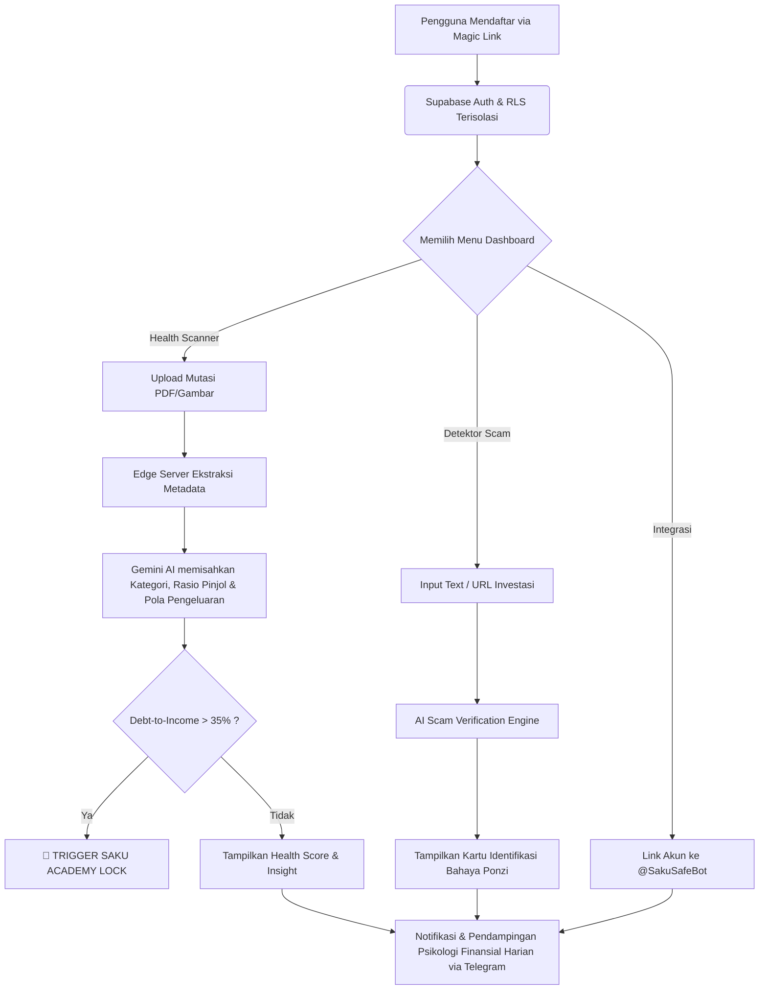

<div align="center">
  

  <br />
  <br />

  <h1>🛡️ SafeWallet: Benteng Terakhir Keuangan Anda</h1>
  
  <p>
    <strong>"Karena tidak ada yang seharusnya hancur hanya karena ketidaktahuan finansial."</strong>
  </p>

  <p>
    Sebuah inisiasi *open-source* berbasis AI yang dirancang sebagai antitesis terhadap epidemi investasi bodong, kebrutalan Pinjaman Online (Pinjol), dan literasi finansial yang stagnan di Indonesia. 
  </p>

  <p>
    <a href="#latar-belakang--rasa"><strong>Pelajari Visi Kami</strong></a> ·
    <a href="#alur-kerja-workflow"><strong>Alur Kerja</strong></a> ·
    <a href="#roadmap-masa-depan"><strong>Roadmap</strong></a> ·
    <a href="#lisensi"><strong>Lisensi</strong></a>
  </p>
  <br />
</div>

---

## 🖤 Latar Belakang & Rasa (The Emotion Behind the Code)

SafeWallet tidak dibangun sekadar sebagai entitas perangkat lunak. Ia dilahirkan dari rasa empati dan kemarahan melihat jutaan masyarakat kelas menengah ke bawah hancur karena taktik predatoris *Pinjaman Online Ilegal* dan buaian ilusi *Skema Ponzi/Investasi Bodong*.

Ada begitu banyak cerita tentang air mata, depresi, hingga hilangnya nyawa hanya karena jeratan hutang yang tak berujung. Sistem keuangan modern sering kali membingungkan dan tidak berpihak kepada rakyat kecil. SafeWallet hadir bukan sebagai aplikasi pencatat keuangan biasa, melainkan sebagai **Psikolog Finansial, Detektif Penipuan, dan Teman Seperjuangan** yang akan menuntun Anda keluar dari krisis keuangan, selangkah demi selangkah.

Dibangun dengan antarmuka *Glassmorphism* gelap (*Dark Onyx*) dan cahaya hijau neon (*Neon Emerald*), SafeWallet dirancang secara psikologis untuk memberikan rasa **Tenang, Aman, dan Harapan**—bahwa seburuk apapun kondisinya, jalan keluar itu masih ada.

---

## 🧠 Konsep & Filosofi Inti

Konsep SafeWallet berdiri pada tiga pilar utama:
1. **Pembedahan Radikal (Radical Transparency):** Membedah dokumen PDF Mutasi Rekening Bank secara otomatis menggunakan AI *(Google Gemini)* untuk melacak setiap sen kebocoran impulsif tanpa penghakiman. Cukup *Drag & Drop*.
2. **Resusitasi Pinjol (Debt-Snowball Rescue):** Sistem mendeteksi otomatis *Debt-to-Income (DTI) Ratio*. Jika telah mencapai ambang batas hancur (>40%), platform memicu protokol "Akademi Darurat" yang menghentikan fitur lain dan memaksa *user* belajar *crisis management* terlebih dahulu.
3. **Peringatan Preventif (Scam Interceptor):** Sebelum mengirimkan uang ke entitas yang menjanjikan pengembalian 300%, pengguna dapat menganalisis deskripsi investasi tersebut. AI kami akan membedah logika *Ponzi* dari janji tersebut dan membandingkannya dengan perizinan OJK seketika itu juga.

---

## ⚙️ Alur Kerja (Workflow) & Arsitektur

Bagaimana SafeWallet melindungi Anda mulai dari titik awal pendaftaran hingga pemulihan ekonomi harian melalui pendampingan.

### Flowchart Integrasi AI & Keamanan



---

## 💎 Modul Front-End & UI/UX

Satu-satunya tumpuan *frontend* terletak pada keahlian `Next.js 15` (App Router) dipadukan dengan desain *Neon-Brutalism x Premium Glassmorphism*.

- **Landing Page, Login, & Signup:** Memberikan transisi keagungan *Zero-Friction* onboarding dengan OTP Magic Link.
- **Bento Box Dashboard:** *Widget* interaktif, dari kalkulasi "Financial Score" *Radial Donut Chart*, hingga riwayat singkat yang responsif untuk Web maupun Mobile.
- **Twin-Screen Profile:** Modul profil Pengguna yang berdampingan lurus dengan instruksi kode terminal-style `/link` untuk koneksi Telegram Bot.

---

## 🛠 Instalasi Lokal (Bagi Developer Pembela Rakyat)

Bantu kami mengembangkan sistem keselamatan ini. Berikut adalah spesifikasi untuk menjalankan aplikasi secara lokal.

1. **Kloning Benteng**
   ```bash
   git clone https://github.com/kazanaruishere-max/SafeWallet.git
   cd SafeWallet
   ```

2. **Siapkan Amunisi (Install Dependencies)**
   ```bash
   npm install
   ```

3. **Injeksi Kunci Aktivasi (Environment Variables)**
   Duplikat file konfigurasi dan isi kunci sandinya.
   ```bash
   cp .env.example .env.local
   # Masukkan kredensial Supabase URL, ANON_KEY, dan GEMINI_API_KEY.
   ```

4. **Koneksikan Mesin Waktu Database (Supabase)**
   ```bash
   npx supabase link --project-ref your-project-id
   npx supabase db push
   ```

5. **Nyalakan Reaktor (Jalankan Lokal)**
   ```bash
   npm run dev
   ```

---

## 🚦 Roadmap Masa Depan

Kami baru mulai. Perjalanan untuk membangun *Financial First-Aid* nasional butuh waktu. Berikut adalah rencana ke depan:

- **[Fase 1] V1.0 (Sekarang):** Saku AI Health Scanner (PDF Mutation), Scam Verificator AI, MVP Telegram Integration OTP, Saku Academy (Debt Snowball Learning), Premium Glassmorphism Redesign.
- **[Fase 2] Algoritma OJK Scrapper:** Sinkronisasi API *Live* setiap 24 jam dengan daftar *Blacklist* SWI (Satgas Waspada Investasi).
- **[Fase 3] Side-Hustle Matchmaker AI:** Analisis pengeluaran yang dihubungkan dengan RAG pekerjaan *Freelance*. AI akan mencari di database pekerjaan kecil yang persis dapat menutup defisit gaji bulanan *User*.
- **[Fase 4] Panggilan Krisis Psikologis:** Modul *Panic Button* yang terhubung ke nomor bantuan psikologis gratis jika AI mendeteksi pesan yang mengindikasi depresi absolut dari interaksi Telegram.

---

## ⚖️ Keamanan Inti (Threat Model Zero-Trust)

Aplikasi dibangun tidak hanya aman, tetapi menaruh keraguan tinggi (*Zero Trust*) pada input dokumen:
- Dokumen mutasi tidak pernah, dan tidak akan pernah **diamankan secara statis**. Eksekusi diproses di *In-Memory Serverless Functions* dan hancur *(garbage collected)* secara natural.
- Pengaplikasian **100% RLS (Row-Level Security) Supabase**. 

Silakan membaca keseluruhan regulasi penanganan ancaman kami pada [SECURITY.md](SECURITY.md).

---

## 🧑‍💻 Persembahan, Kode, & Sang Kreator

Dibangun dan diarahkan oleh **Kazanaru**. Aplikasi ini adalah bukti dedikasi bahwa kode harus digunakan sebagai perisai, alat keadilan, dan teman di saat masyarakat paling membutuhkan pertolongan struktural.

Jika Anda memiliki dedikasi serupa untuk mengembalikan kemanusiaan lewat kode perangkat lunak, jangan ragu untuk menekan tombol **Star**, membuka **Pull Request**, atau mempelajari cara menolong audiens serupa di negara manapun di dunia.

---

## 📜 Lisensi

Kode sumber dari aplikasi mulia ini dilepaskan sebagai bentuk open-source dan didistribusikan di bawah **Lisensi MIT**. 

Hak Cipta (c) 2026 **Kazanaru** – Lihat berkas [LICENSE](LICENSE) untuk detail hukum secara menyeluruh. Hak Anda bebas untuk menggunakan, meneruskan, memperdagangkan, dan mengubah kode kami. Bantu kami mengubah dunia.
