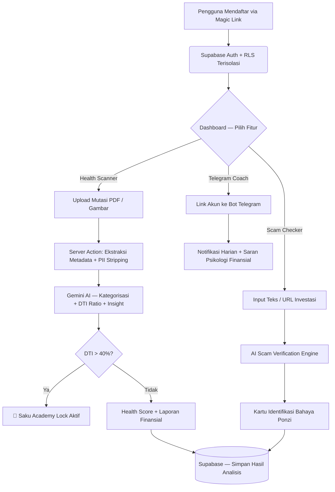

<div align="center">

<br />


<br />
<br />

<h1>🛡️ SafeWallet</h1>
<h3>AI Financial Wellness Platform for Indonesia</h3>

<p>
  <em>"Karena tidak ada yang seharusnya hancur hanya karena ketidaktahuan finansial."</em>
</p>

<p>
  Platform berbasis AI yang dirancang sebagai antitesis terhadap epidemi investasi bodong,<br />
  kebrutalan Pinjaman Online (Pinjol), dan rendahnya literasi finansial di Indonesia.
</p>

<br />

<a href="#-demo--deployment"><strong>🌐 Lihat Demo Live</strong></a> ·
<a href="#-arsitektur--alur-kerja"><strong>📐 Arsitektur</strong></a> ·
<a href="#-tech-stack"><strong>🛠 Tech Stack</strong></a> ·
<a href="#-instalasi-lokal"><strong>⚙️ Instalasi</strong></a> ·
<a href="#-roadmap"><strong>🚦 Roadmap</strong></a>

<br />
<br />

> [!NOTE]  
> **📢 CATATAN PENTING — INI ADALAH PROYEK DEMO**  
> Aplikasi ini berstatus **demo/prototipe** dan saat ini menggunakan ekosistem **Cloud SaaS gratis/tier free**:
> Supabase (Free Tier), Vercel (Hobby Plan), Upstash Redis (Free Tier), dan Google Gemini API (Free Tier).
> Batas kapasitas, kuota, dan performa bergantung pada batasan tiap layanan tersebut.
> **Tidak disarankan untuk penggunaan produksi dengan data nyata dan volume tinggi** sebelum upgrade ke tier berbayar.

</div>

---

## 🌐 Demo & Deployment

| Environment | URL |
|---|---|
| **Production (Live Demo)** | [https://safe-wallet-orpin.vercel.app](https://safe-wallet-orpin.vercel.app) |
| **Platform** | Vercel (Hobby Plan) |
| **Database** | Supabase (Free Tier — Singapore Region) |

---

## 🧠 Konsep & Filosofi Inti

SafeWallet berdiri pada **tiga pilar utama**:

1. **Pembedahan Radikal (Radical Transparency)**  
   Membedah dokumen PDF/Gambar Mutasi Rekening Bank secara otomatis menggunakan AI *(Google Gemini)* untuk melacak setiap kebocoran finansial pasif. Cukup *Drag & Drop*.

2. **Resusitasi Pinjol (Debt-Snowball Rescue)**  
   Sistem mendeteksi otomatis *Debt-to-Income (DTI) Ratio*. Jika melampaui ambang batas kritis (>40%), platform memicu protokol "Saku Academy Lock" yang membimbing pengguna keluar dari krisis.

3. **Peringatan Preventif (Scam Interceptor)**  
   Sebelum mengirim uang ke entitas yang menjanjikan imbal hasil tidak wajar, pengguna bisa menganalisis deskripsi investasi tersebut. AI akan membedah pola Ponzi secara seketika.

---

## 📐 Arsitektur & Alur Kerja



---

## 🛠 Tech Stack

### Frontend

| Teknologi | Versi | Keterangan |
|---|---|---|
| [Next.js](https://nextjs.org/) | `15` (App Router) | Framework utama — SSR + Server Actions |
| [React](https://react.dev/) | `19` | UI Library |
| [TypeScript](https://www.typescriptlang.org/) | `5` | Type Safety |
| [Tailwind CSS](https://tailwindcss.com/) | `3` | Utility-first styling |
| [GSAP](https://gsap.com/) | `3.12` | Animasi scroll cinematic (ScrollTrigger) |
| [Framer Motion](https://www.framer.com/motion/) | `^11` | Transisi halaman & micro-animations |
| [React Bits](https://www.reactbits.dev/) | Custom | Komponen visual premium (ScrollVelocity, FlowingMenu, dll.) |
| [Lucide React](https://lucide.dev/) | Latest | Icon system |

### Backend & Database

| Teknologi | Keterangan |
|---|---|
| [Supabase](https://supabase.com/) *(Free Tier)* | PostgreSQL Database + Auth (Magic Link + Email) + Row-Level Security (RLS) |
| [Next.js Server Actions](https://nextjs.org/) | Business logic untuk upload mutasi & analisis AI |
| [Next.js API Routes](https://nextjs.org/) | Endpoint REST: scan, scam-check, webhooks, cron jobs |

### AI & Intelligence

| Teknologi | Keterangan |
|---|---|
| [Google Gemini 2.0 Flash](https://ai.google.dev/) *(Free Tier)* | Model AI utama — OCR Mutasi Bank, Kategorisasi, Scam Detection |
| Custom `sanitize.ts` | PII Stripping (ID, Email, Nomor Rekening) sebelum data dikirim ke AI |

### Infrastructure & DevOps

| Teknologi | Keterangan |
|---|---|
| [Vercel](https://vercel.com/) *(Hobby Plan)* | Hosting + Serverless Functions + Edge Middleware |
| [Upstash Redis](https://upstash.com/) *(Free Tier)* | IP-based Rate Limiting via `@upstash/ratelimit` |
| [Midtrans](https://midtrans.com/) | Payment Gateway (Subscription) — Webhook dengan SHA-512 verification |
| [Sentry](https://sentry.io/) *(Free Tier)* | Error monitoring & alerting |
| [Telegram Bot API](https://core.telegram.org/bots/api) | Daily coaching notifications |

### Security Stack

| Mekanisme | Implementasi |
|---|---|
| SHA-512 Signature Verification | Midtrans Webhook (`C1`) |
| IP Rate Limiting | Upstash Redis via Middleware (`H2`) |
| PII Stripping | `src/lib/sanitize.ts` (`H3`) |
| Telegram Webhook Secret Token | `X-Telegram-Bot-Api-Secret-Token` header (`H5`) |
| Cron Job Auth | `CRON_SECRET` enforced (`C2`) |
| Audit Logging | `src/lib/audit-logger.ts` → `audit_logs` table (`M6`) |
| Zero-Retention Files | File mutasi **tidak pernah disimpan** di storage — hanya diproses di memory |
| HSTS + CSP Headers | `next.config.ts` — Security Headers OWASP |

---

## ⚙️ Instalasi Lokal

### Prerequisites

- Node.js `v20+`
- npm `v10+`
- Akun [Supabase](https://supabase.com/)
- Akun [Google AI Studio](https://aistudio.google.com/) (untuk Gemini API Key)

### Langkah Instalasi

```bash
# 1. Clone repositori
git clone https://github.com/kazanaruishere-max/SafeWallet.git
cd SafeWallet

# 2. Install dependencies
npm install

# 3. Salin file env dan isi kredensial
cp .env.example .env.local
```

Isi `.env.local` dengan variabel berikut:

```env
# Supabase
NEXT_PUBLIC_SUPABASE_URL=your_supabase_url
NEXT_PUBLIC_SUPABASE_ANON_KEY=your_anon_key
SUPABASE_SERVICE_ROLE_KEY=your_service_role_key

# Google Gemini
GEMINI_API_KEY=your_gemini_api_key

# Midtrans (Opsional - untuk Fitur Langganan)
MIDTRANS_SERVER_KEY=your_midtrans_server_key
MIDTRANS_CLIENT_KEY=your_midtrans_client_key

# Upstash Redis (Opsional - untuk Rate Limiting)
UPSTASH_REDIS_REST_URL=your_upstash_url
UPSTASH_REDIS_REST_TOKEN=your_upstash_token

# Telegram Bot (Opsional - untuk Coaching Notifications)
TELEGRAM_BOT_TOKEN=your_telegram_bot_token

# Cron Job Security
CRON_SECRET=your_cron_secret_random_string

# Sentry (Opsional - untuk Error Monitoring)
SENTRY_DSN=your_sentry_dsn
```

```bash
# 4. Jalankan development server
npm run dev
```

Buka [http://localhost:3000](http://localhost:3000) di browser.

---

## 🚦 Roadmap

| Fase | Status | Deskripsi |
|---|---|---|
| **Fase 1 — MVP** | ✅ Complete | AI Health Scanner, Scam Detector, Telegram Integration, Langganan Premium |
| **Fase 2 — OJK Integration** | 🔲 Planned | Sinkronisasi API live dengan Blacklist SWI (Satgas Waspada Investasi) OJK |
| **Fase 3 — Side-Hustle AI** | 🔲 Planned | Analisis pengeluaran + RAG Database pekerjaan freelance untuk menutup defisit gaji |
| **Fase 4 — Crisis Panic Button** | 🔲 Planned | Tombol darurat terhubung ke nomor bantuan psikologis & Konselor OJK |

---

## ⚖️ Keamanan

Aplikasi dibangun dengan prinsip **Zero-Trust**:

- Dokumen mutasi bank **tidak pernah disimpan** secara permanen. Eksekusi dilakukan di *Serverless In-Memory Functions*.
- **100% Row-Level Security (RLS)** di seluruh tabel Supabase.
- Full audit trail untuk semua aksi sensitif pengguna.

Baca selengkapnya di [SECURITY.md](SECURITY.md).

---

## 🧑‍💻 Kreator

Dibuat dengan dedikasi oleh **[Kazanaru](https://github.com/kazanaruishere-max)**.

> *"Kode adalah perisai. Teknologi adalah alat keadilan."*

---

## 📜 Lisensi

Didistribusikan di bawah **Lisensi MIT**.  
Lihat berkas [LICENSE](LICENSE) untuk detail lengkap.

Hak Cipta © 2026 **Kazanaru**
