<div align="center">

<br />


<br />
<br />

<h1>🛡️ SafeWallet</h1>
<h3>AI Financial Wellness Platform for Indonesia</h3>

<p>
  <a href="#-bahasa-indonesia">🇮🇩 Bahasa Indonesia</a> · <a href="#-english">🇬🇧 English</a>
</p>

<br />

> [!CAUTION]
> **📢 THIS PROJECT IS A DEMO / PROTOTYPE**
> This application is currently running as a **demonstration prototype** on free-tier **Cloud SaaS** services:
> Supabase (Free), Google Cloud Run (Free-Tier), Vercel (Hobby), Upstash Redis (Free), Groq API, and Sentry (Free).
> Capacity, quotas, and performance are strictly limited by each service's free-tier constraints.
> **DO NOT USE FOR PRODUCTION WITH REAL FINANCIAL DATA OR PII.** Upgrade to enterprise/paid tiers before deploying to a high-traffic production environment.

</div>

---

# 🇮🇩 Bahasa Indonesia

## Tentang SafeWallet

SafeWallet adalah platform berbasis AI yang dirancang sebagai antitesis terhadap epidemi investasi bodong, kebrutalan Pinjaman Online (Pinjol), dan rendahnya literasi finansial di Indonesia. Platform ini dirancang dengan pendekatan keamanan tinggi (*Zero-Trust*).

> *"Karena tidak ada yang seharusnya hancur hanya karena ketidaktahuan finansial."*

### Konsep & Fitur Inti

1. **Health Scanner (Pembedahan Radikal)** — Membedah dokumen mutasi rekening bank secara otomatis (via OCR & LLM) untuk mengkategorikan pengeluaran dan menemukan anomali finansial seperti judi online atau langganan siluman.
2. **Saku Academy Lock (Resusitasi Pinjol)** — Mendeteksi *Debt-to-Income Ratio* (DTI). Jika melampaui 35%, antarmuka akan terkunci dalam mode penyelamatan untuk memandu pengguna keluar dari krisis.
3. **Scam Checker (Peringatan Preventif)** — Menganalisis deskripsi investasi untuk membedah pola Ponzi atau skema piramida seketika menggunakan RAG (Retrieval-Augmented Generation) berbasis database entitas ilegal OJK.
4. **AI Pengacara (Legal Generator)** — Generator otomatis untuk dokumen hukum dasar dan somasi perlindungan konsumen.
5. **Data Breach (Kebocoran Data)** — Pemantauan dan peringatan *real-time* jika kredensial atau data pribadi pengguna ditemukan di web gelap atau database kebocoran eksternal.
6. **Integrasi Bot Telegram Saku** — Memberikan ringkasan, notifikasi pengeluaran, *coaching* harian interaktif cepat, serta sistem penautan & pemutusan akun yang aman.

### 🌐 Demo Live & Integrasi

| Lingkungan | URL |
|---|---|
| **Production App (Web)** | [safewallet-app-240283524030.asia-southeast2.run.app](https://safewallet-app-240283524030.asia-southeast2.run.app/) |
| **Telegram Bot Link** | [@SakuSafeBot](https://t.me/SakuSafeBot) |

---

## 📐 Arsitektur Sistem & Workflow

SafeWallet memiliki arsitektur modular dengan performa tinggi yang terbagi dalam beberapa *pipeline* fitur. Berikut adalah rincian struktur arsitektur dan workflow lengkap untuk semua fitur utama di dalam SafeWallet.

### 1. Arsitektur Utama (High-Level)

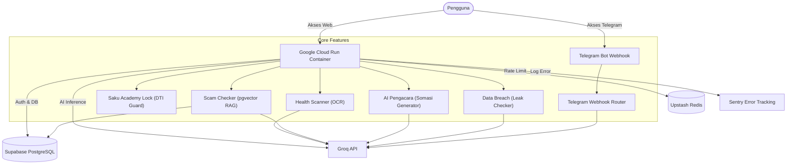
```mermaid
graph TD
    User([Pengguna]) -->|Akses Web| CloudRun[Google Cloud Run Container]
    User -->|Akses Telegram| TeleBot[Telegram Bot Webhook]

    CloudRun -->|Auth & DB| Supabase[(Supabase PostgreSQL)]
    CloudRun -->|Rate Limit| Upstash[(Upstash Redis)]
    CloudRun -->|AI Inference| Groq[Groq API]
    
    subgraph Core_Features [Core Features]
        CloudRun --> Scanner["Health Scanner (OCR)"]
        CloudRun --> ScamCheck["Scam Checker (pgvector RAG)"]
        CloudRun --> SakuAcademy["Saku Academy Lock (DTI Guard)"]
        CloudRun --> LegalGen["AI Pengacara (Somasi Generator)"]
        CloudRun --> Breach["Data Breach (Leak Checker)"]
        TeleBot --> WebhookRouter["Telegram Webhook Router"]
    end

    Scanner --> Groq
    ScamCheck --> Supabase
    ScamCheck --> Groq
    LegalGen --> Groq
    Breach --> Groq
    WebhookRouter --> Groq
    
    CloudRun -->|Log Error| Sentry[Sentry Error Tracking]
```

---

### 2. Workflow Detil Fitur

#### Fitur A: Health Scanner (Upload Mutasi)
Proses pemindaian riwayat keuangan pengguna tanpa menyimpan berkas asli secara permanen.

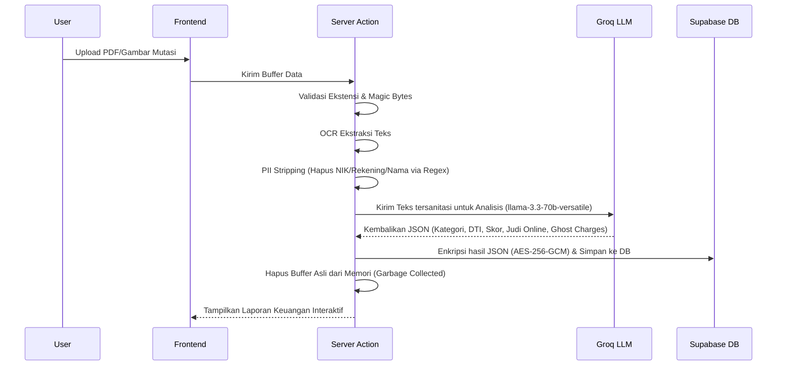
```mermaid
sequenceDiagram
    participant U as User
    participant F as Frontend
    participant S as Server Action
    participant AI as Groq LLM
    participant DB as Supabase DB

    U->>F: Upload PDF/Gambar Mutasi
    F->>S: Kirim Buffer Data
    S->>S: Validasi Ekstensi & Magic Bytes
    S->>S: OCR Ekstraksi Teks
    S->>S: PII Stripping (Hapus NIK/Rekening/Nama via Regex)
    S->>AI: Kirim Teks tersanitasi untuk Analisis (llama-3.3-70b-versatile)
    AI-->>S: Kembalikan JSON (Kategori, DTI, Skor, Judi Online, Ghost Charges)
    S->>DB: Enkripsi hasil JSON (AES-256-GCM) & Simpan ke DB
    S->>S: Hapus Buffer Asli dari Memori (Garbage Collected)
    S-->>F: Tampilkan Laporan Keuangan Interaktif
```

#### Fitur B: Scam Checker (RAG OJK)
Memanfaatkan RAG (Retrieval-Augmented Generation) untuk mencocokkan input dengan modus operandi penipuan.

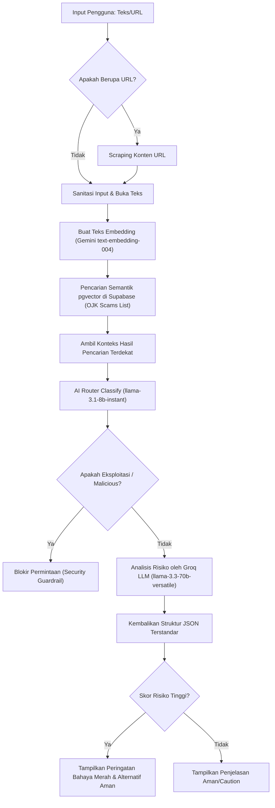
```mermaid
flowchart TD
    A["Input Pengguna: Teks/URL"] --> B{"Apakah Berupa URL?"}
    B -- Ya --> C["Scraping Konten URL"]
    B -- Tidak --> D["Sanitasi Input & Buka Teks"]
    C --> D
    D --> E["Buat Teks Embedding (Gemini text-embedding-004)"]
    E --> F["Pencarian Semantik pgvector di Supabase (OJK Scams List)"]
    F --> G["Ambil Konteks Hasil Pencarian Terdekat"]
    G --> H["AI Router Classify (llama-3.1-8b-instant)"]
    H --> I{"Apakah Eksploitasi / Malicious?"}
    I -- Ya --> J["Blokir Permintaan (Security Guardrail)"]
    I -- Tidak --> K["Analisis Risiko oleh Groq LLM (llama-3.3-70b-versatile)"]
    K --> L["Kembalikan Struktur JSON Terstandar"]
    L --> M{"Skor Risiko Tinggi?"}
    M -- Ya --> N["Tampilkan Peringatan Bahaya Merah & Alternatif Aman"]
    M -- Tidak --> O["Tampilkan Penjelasan Aman/Caution"]
```

#### Fitur C: Saku Academy Lock (Crisis Mode)
State machine penguncian halaman dashboard utama apabila pengeluaran DTI (*Debt-to-Income*) melampaui batas aman.

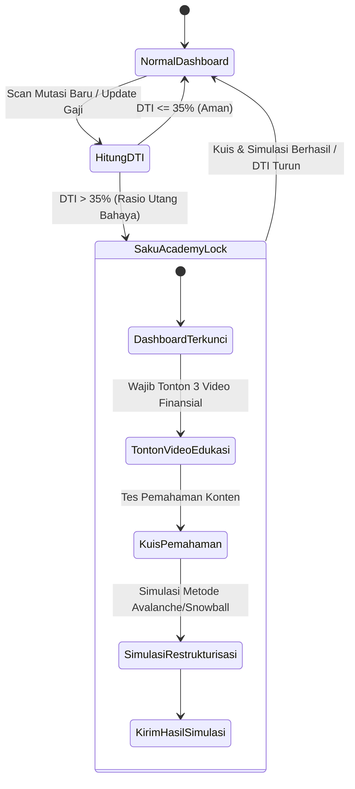
```mermaid
stateDiagram-v2
    [*] --> NormalDashboard
    NormalDashboard --> HitungDTI: Scan Mutasi Baru / Update Gaji
    HitungDTI --> SakuAcademyLock: DTI > 35% (Rasio Utang Bahaya)
    HitungDTI --> NormalDashboard: DTI <= 35% (Aman)
    
    state SakuAcademyLock {
        [*] --> DashboardTerkunci
        DashboardTerkunci --> TontonVideoEdukasi: Wajib Tonton 3 Video Finansial
        TontonVideoEdukasi --> KuisPemahaman: Tes Pemahaman Konten
        KuisPemahaman --> SimulasiRestrukturisasi: Simulasi Metode Avalanche/Snowball
        SimulasiRestrukturisasi --> KirimHasilSimulasi
    }
    
    SakuAcademyLock --> NormalDashboard: Kuis & Simulasi Berhasil / DTI Turun
```

#### Fitur D: AI Pengacara (Legal Generator)
Generator otomatis untuk menyusun somasi hukum dasar berbasis kronologi pengguna.

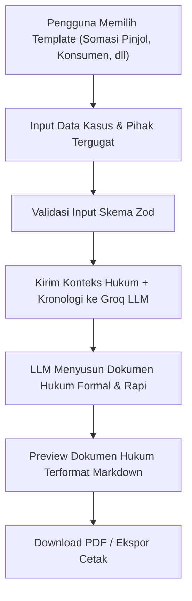
```mermaid
flowchart TD
    A["Pengguna Memilih Template (Somasi Pinjol, Konsumen, dll)"] --> B["Input Data Kasus & Pihak Tergugat"]
    B --> C["Validasi Input Skema Zod"]
    C --> D["Kirim Konteks Hukum + Kronologi ke Groq LLM"]
    D --> E["LLM Menyusun Dokumen Hukum Formal & Rapi"]
    E --> F["Preview Dokumen Hukum Terformat Markdown"]
    F --> G["Download PDF / Ekspor Cetak"]
```

#### Fitur E: Data Breach (Deteksi Kebocoran Data)
Pemantauan keamanan data pribadi pengguna secara instan dan rahasia.

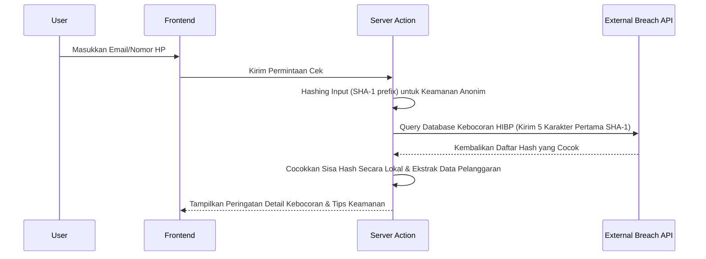
```mermaid
sequenceDiagram
    participant U as User
    participant F as Frontend
    participant S as Server Action
    participant HIBP as External Breach API
    
    U->>F: Masukkan Email/Nomor HP
    F->>S: Kirim Permintaan Cek
    S->>S: Hashing Input (SHA-1 prefix) untuk Keamanan Anonim
    S->>HIBP: Query Database Kebocoran HIBP (Kirim 5 Karakter Pertama SHA-1)
    HIBP-->>S: Kembalikan Daftar Hash yang Cocok
    S->>S: Cocokkan Sisa Hash Secara Lokal & Ekstrak Data Pelanggaran
    S-->>F: Tampilkan Peringatan Detail Kebocoran & Tips Keamanan
```

#### Fitur F: Integrasi Bot Telegram Saku (Conversational Bot)
Workflow penautan bot Telegram Saku, pemutusan akun, dan penyampaian coaching harian super cepat dengan ketahanan tinggi.

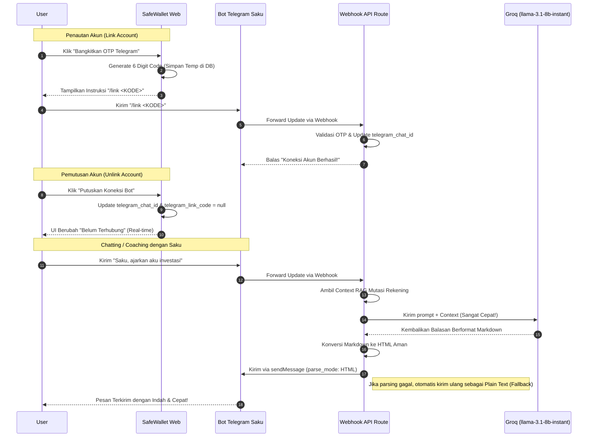
```mermaid
sequenceDiagram
    autonumber
    participant U as User
    participant Web as SafeWallet Web
    participant Bot as Bot Telegram Saku
    participant Webhook as Webhook API Route
    participant AI as Groq (llama-3.1-8b-instant)
    
    Note over U, Web: Penautan Akun (Link Account)
    U->>Web: Klik "Bangkitkan OTP Telegram"
    Web->>Web: Generate 6 Digit Code (Simpan Temp di DB)
    Web-->>U: Tampilkan Instruksi "/link <KODE>"
    U->>Bot: Kirim "/link <KODE>"
    Bot->>Webhook: Forward Update via Webhook
    Webhook->>Webhook: Validasi OTP & Update telegram_chat_id
    Webhook-->>Bot: Balas "Koneksi Akun Berhasil!"
    
    Note over U, Web: Pemutusan Akun (Unlink Account)
    U->>Web: Klik "Putuskan Koneksi Bot"
    Web->>Web: Update telegram_chat_id & telegram_link_code = null
    Web-->>U: UI Berubah "Belum Terhubung" (Real-time)
    
    Note over U, Bot: Chatting / Coaching dengan Saku
    U->>Bot: Kirim "Saku, ajarkan aku investasi"
    Bot->>Webhook: Forward Update via Webhook
    Webhook->>Webhook: Ambil Context RAG Mutasi Rekening
    Webhook->>AI: Kirim prompt + Context (Sangat Cepat!)
    AI-->>Webhook: Kembalikan Balasan Berformat Markdown
    Webhook->>Webhook: Konversi Markdown ke HTML Aman
    Webhook->>Bot: Kirim via sendMessage (parse_mode: HTML)
    Note right of Webhook: Jika parsing gagal, otomatis kirim ulang sebagai Plain Text (Fallback)
    Bot-->>U: Pesan Terkirim dengan Indah & Cepat!
```

---

## 🛠 CI/CD Pipeline

Proyek ini menggunakan GitHub Actions dan Google Cloud Run untuk otomatisasi *Continuous Integration* dan *Continuous Deployment*.

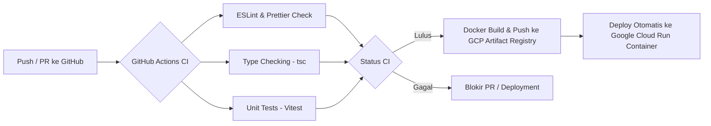
```mermaid
flowchart LR
    A[Push / PR ke GitHub] --> B{GitHub Actions CI}
    B --> C[ESLint & Prettier Check]
    B --> D[Type Checking - tsc]
    B --> E[Unit Tests - Vitest]
    C --> F{Status CI}
    D --> F
    E --> F
    F -- Lulus --> G[Docker Build & Push ke GCP Artifact Registry]
    F -- Gagal --> H[Blokir PR / Deployment]
    G --> I[Deploy Otomatis ke Google Cloud Run Container]
```

---

## 🛡️ Keamanan & Privasi (Security Policy)

SafeWallet mengimplementasikan prinsip keamanan **Zero-Trust** pada aplikasi finansial. Rincian lebih lanjut dapat dibaca di [SECURITY.md](SECURITY.md).

### Fokus Utama Keamanan:
1. **Zero Retention (Tidak Ada Penyimpanan Berkas)**: Dokumen PDF/gambar transaksi pengguna **tidak pernah disimpan** di *bucket storage* manapun. Diproses di memori dan langsung dihancurkan (Garbage Collected).
2. **PII Stripping Otomatis**: Data *Personally Identifiable Information* seperti NIK, Nomor Rekening, dan Email disensor menggunakan *Regex* sebelum dikirim ke Groq AI.
3. **Enkripsi Data At Rest**: Teks hasil OCR yang perlu disimpan (jika pengguna mengizinkan riwayat) dienkripsi secara ketat menggunakan **AES-256-GCM** sebelum masuk ke *database* PostgreSQL.
4. **Rate Limiting Edge-Level**: Menggunakan Upstash Redis, kami mencegah serangan DDoS, *brute force*, dan pengurasan kuota AI (AI limit: 5/menit, General limit: 50/menit per IP).
5. **Row-Level Security (RLS)**: Setiap akses ke *database* dijamin melalui Supabase RLS agar pengguna A tidak mungkin dapat membaca *scan_history* milik pengguna B.

---

## ⚙️ Instalasi Lokal

```bash
# 1. Clone
git clone https://github.com/kazanaruishere-max/SafeWallet.git && cd SafeWallet

# 2. Install dependencies
npm install

# 3. Setup environment
cp .env.example .env.local
# Isi kredensial di .env.local

# 4. Jalankan Server Dev
npm run dev
```

Buka [http://localhost:3000](http://localhost:3000).

Untuk berkontribusi, silakan baca [CONTRIBUTING.md](CONTRIBUTING.md).

---

# 🇬🇧 English

## About SafeWallet

SafeWallet is an AI-powered financial wellness platform designed to combat the epidemic of investment fraud, predatory online lending (Pinjol), and low financial literacy in Indonesia. The platform is designed with a high-security approach (Zero-Trust).

> *"Because no one should be destroyed simply by financial ignorance."*

### Core Concepts & Features

1. **Health Scanner (Radical Dissection)** — Automatically dissect bank statement documents via OCR & LLM to categorize spending and find financial anomalies like online gambling or phantom subscription charges.
2. **Saku Academy Lock (Predatory Lending Rescue)** — Detects Debt-to-Income Ratio (DTI). If it exceeds 35%, the interface locks into a rescue mode to guide users out of crisis.
3. **Scam Interceptor (Preventive Warning)** — Analyzes investment descriptions to dissect Ponzi or pyramid patterns instantly using Retrieval-Augmented Generation (RAG) backed by official OJK database.
4. **AI Lawyer (Legal Generator)** — Automated generator for basic legal documents and consumer protection cease-and-desists.
5. **Data Breach Monitor** — Real-time monitoring and alerts if user credentials or personal data are found on the dark web or leaked databases.
6. **Saku Telegram Bot Integration** — Provides expense notifications, interactive real-time daily coaching tips, and secure link/unlink account systems.

### 🌐 Live Demo & Integrations

| Environment | URL |
|---|---|
| **Production App (Web)** | [safewallet-app-240283524030.asia-southeast2.run.app](https://safewallet-app-240283524030.asia-southeast2.run.app/) |
| **Telegram Bot Link** | [@SakuSafeBot](https://t.me/SakuSafeBot) |

---

## 📐 System Architecture & Workflow

SafeWallet has a highly performant and modular architecture separated into several feature pipelines. Below are detailed system architecture structures and complete workflows for all major features inside SafeWallet.

### 1. High-Level Architecture

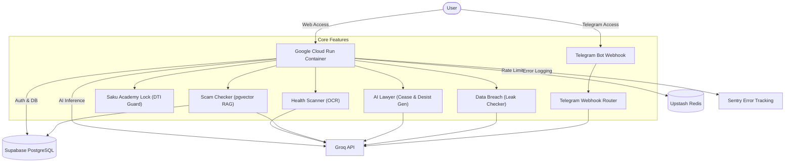
```mermaid
graph TD
    User([User]) -->|Web Access| CloudRun[Google Cloud Run Container]
    User -->|Telegram Access| TeleBot[Telegram Bot Webhook]

    CloudRun -->|Auth & DB| Supabase[(Supabase PostgreSQL)]
    CloudRun -->|Rate Limit| Upstash[(Upstash Redis)]
    CloudRun -->|AI Inference| Groq[Groq API]
    
    subgraph Core_Features [Core Features]
        CloudRun --> Scanner["Health Scanner (OCR)"]
        CloudRun --> ScamCheck["Scam Checker (pgvector RAG)"]
        CloudRun --> SakuAcademy["Saku Academy Lock (DTI Guard)"]
        CloudRun --> LegalGen["AI Lawyer (Cease & Desist Gen)"]
        CloudRun --> Breach["Data Breach (Leak Checker)"]
        TeleBot --> WebhookRouter["Telegram Webhook Router"]
    end

    Scanner --> Groq
    ScamCheck --> Supabase
    ScamCheck --> Groq
    LegalGen --> Groq
    Breach --> Groq
    WebhookRouter --> Groq
    
    CloudRun -->|Error Logging| Sentry[Sentry Error Tracking]
```

---

### 2. Feature Workflows in Detail

#### Feature A: Health Scanner (Statement Upload)
Process bank statements without storing the original files permanently on the server.

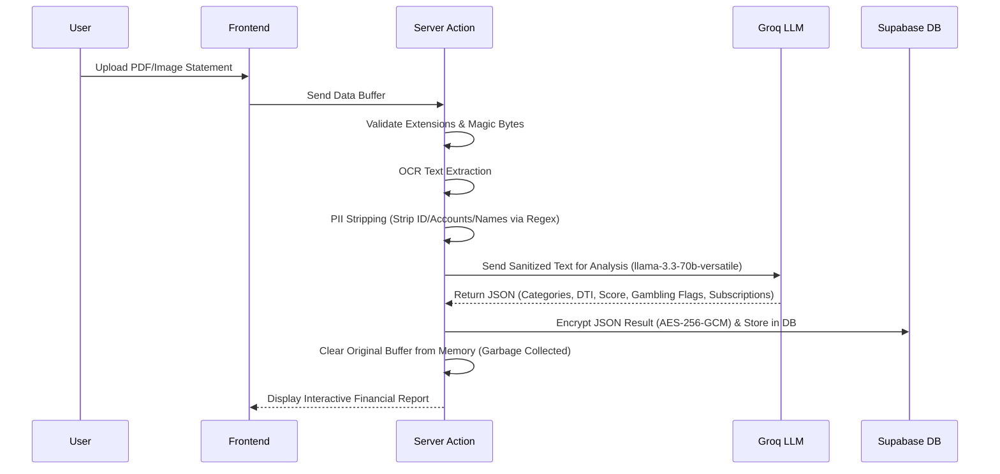
```mermaid
sequenceDiagram
    participant U as User
    participant F as Frontend
    participant S as Server Action
    participant AI as Groq LLM
    participant DB as Supabase DB

    U->>F: Upload PDF/Image Statement
    F->>S: Send Data Buffer
    S->>S: Validate Extensions & Magic Bytes
    S->>S: OCR Text Extraction
    S->>S: PII Stripping (Strip ID/Accounts/Names via Regex)
    S->>AI: Send Sanitized Text for Analysis (llama-3.3-70b-versatile)
    AI-->>S: Return JSON (Categories, DTI, Score, Gambling Flags, Subscriptions)
    S->>DB: Encrypt JSON Result (AES-256-GCM) & Store in DB
    S->>S: Clear Original Buffer from Memory (Garbage Collected)
    S-->>F: Display Interactive Financial Report
```

#### Feature B: Scam Interceptor (OJK RAG)
Utilizes RAG (Retrieval-Augmented Generation) to classify and assess investment offers against official OJK records.

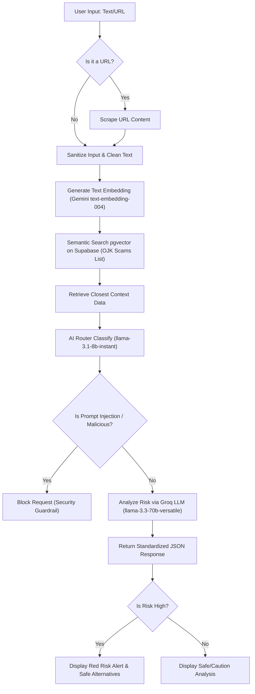
```mermaid
flowchart TD
    A["User Input: Text/URL"] --> B{"Is it a URL?"}
    B -- Yes --> C["Scrape URL Content"]
    B -- No --> D["Sanitize Input & Clean Text"]
    C --> D
    D --> E["Generate Text Embedding (Gemini text-embedding-004)"]
    E --> F["Semantic Search pgvector on Supabase (OJK Scams List)"]
    F --> G["Retrieve Closest Context Data"]
    G --> H["AI Router Classify (llama-3.1-8b-instant)"]
    H --> I{"Is Prompt Injection / Malicious?"}
    I -- Yes --> J["Block Request (Security Guardrail)"]
    I -- No --> K["Analyze Risk via Groq LLM (llama-3.3-70b-versatile)"]
    K --> L["Return Standardized JSON Response"]
    L --> M{"Is Risk High?"}
    M -- Yes --> N["Display Red Risk Alert & Safe Alternatives"]
    M -- No --> O["Display Safe/Caution Analysis"]
```

#### Feature C: Saku Academy Lock (Crisis Mode)
State machine dashboard locking mechanism when the DTI (Debt-to-Income) ratio surpasses safe levels.

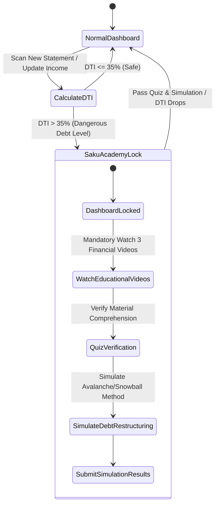
```mermaid
stateDiagram-v2
    [*] --> NormalDashboard
    NormalDashboard --> CalculateDTI: Scan New Statement / Update Income
    CalculateDTI --> SakuAcademyLock: DTI > 35% (Dangerous Debt Level)
    CalculateDTI --> NormalDashboard: DTI <= 35% (Safe)
    
    state SakuAcademyLock {
        [*] --> DashboardLocked
        DashboardLocked --> WatchEducationalVideos: Mandatory Watch 3 Financial Videos
        WatchEducationalVideos --> QuizVerification: Verify Material Comprehension
        QuizVerification --> SimulateDebtRestructuring: Simulate Avalanche/Snowball Method
        SimulateDebtRestructuring --> SubmitSimulationResults
    }
    
    SakuAcademyLock --> NormalDashboard: Pass Quiz & Simulation / DTI Drops
```

#### Feature D: AI Lawyer (Legal Generator)
Automated generator to draft formal legal cease-and-desist documents.

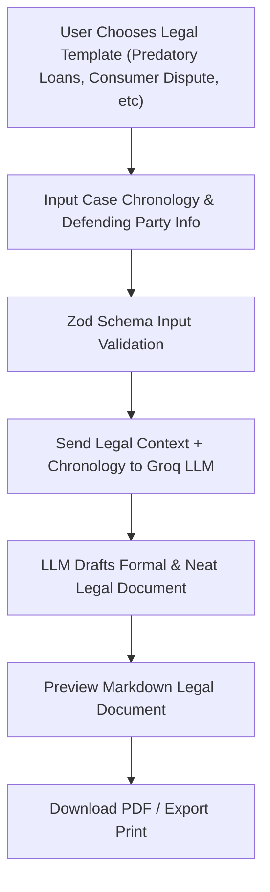
```mermaid
flowchart TD
    A["User Chooses Legal Template (Predatory Loans, Consumer Dispute, etc)"] --> B["Input Case Chronology & Defending Party Info"]
    B --> C["Zod Schema Input Validation"]
    C --> D["Send Legal Context + Chronology to Groq LLM"]
    D --> E["LLM Drafts Formal & Neat Legal Document"]
    E --> F["Preview Markdown Legal Document"]
    F --> G["Download PDF / Export Print"]
```

#### Feature E: Data Breach Monitor
Instant, encrypted check of compromised personal data.

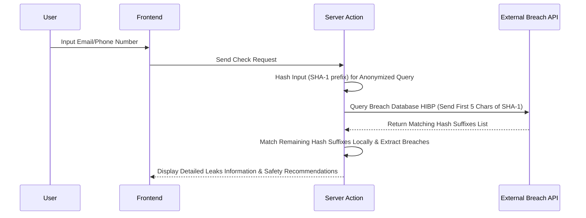
```mermaid
sequenceDiagram
    participant U as User
    participant F as Frontend
    participant S as Server Action
    participant HIBP as External Breach API
    
    U->>F: Input Email/Phone Number
    F->>S: Send Check Request
    S->>S: Hash Input (SHA-1 prefix) for Anonymized Query
    S->>HIBP: Query Breach Database HIBP (Send First 5 Chars of SHA-1)
    HIBP-->>S: Return Matching Hash Suffixes List
    S->>S: Match Remaining Hash Suffixes Locally & Extract Breaches
    S-->>F: Display Detailed Leaks Information & Safety Recommendations
```

#### Feature F: Saku Telegram Bot Integration (Conversational Bot)
Workflow of linking accounts, unlinking bot, and delivering blazing fast, resilient AI coaching tips.

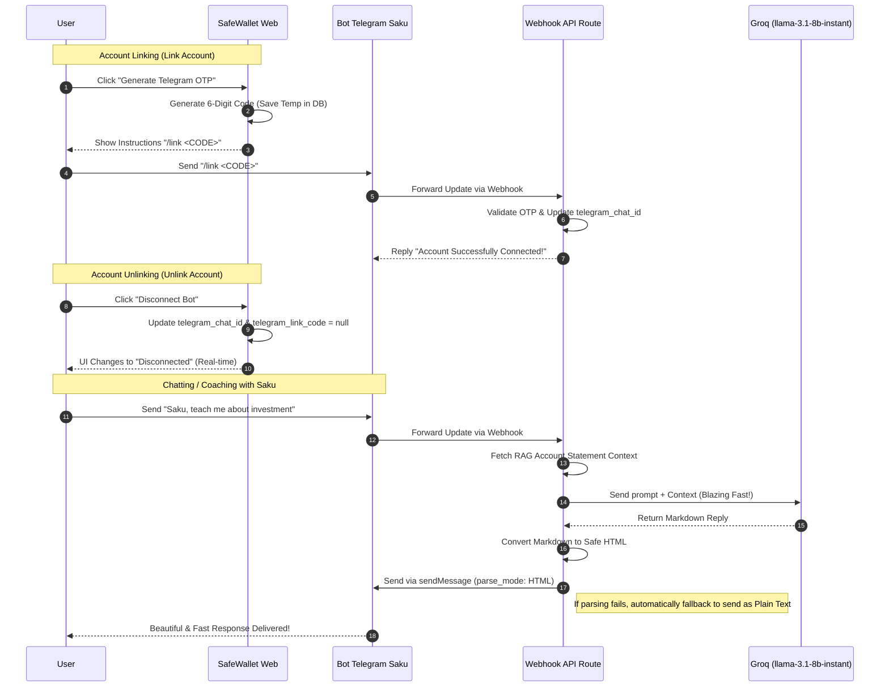
```mermaid
sequenceDiagram
    autonumber
    participant U as User
    participant Web as SafeWallet Web
    participant Bot as Bot Telegram Saku
    participant Webhook as Webhook API Route
    participant AI as Groq (llama-3.1-8b-instant)
    
    Note over U, Web: Account Linking (Link Account)
    U->>Web: Click "Generate Telegram OTP"
    Web->>Web: Generate 6-Digit Code (Save Temp in DB)
    Web-->>U: Show Instructions "/link <CODE>"
    U->>Bot: Send "/link <CODE>"
    Bot->>Webhook: Forward Update via Webhook
    Webhook->>Webhook: Validate OTP & Update telegram_chat_id
    Webhook-->>Bot: Reply "Account Successfully Connected!"
    
    Note over U, Web: Account Unlinking (Unlink Account)
    U->>Web: Click "Disconnect Bot"
    Web->>Web: Update telegram_chat_id & telegram_link_code = null
    Web-->>U: UI Changes to "Disconnected" (Real-time)
    
    Note over U, Bot: Chatting / Coaching with Saku
    U->>Bot: Send "Saku, teach me about investment"
    Bot->>Webhook: Forward Update via Webhook
    Webhook->>Webhook: Fetch RAG Account Statement Context
    Webhook->>AI: Send prompt + Context (Blazing Fast!)
    AI-->>Webhook: Return Markdown Reply
    Webhook->>Webhook: Convert Markdown to Safe HTML
    Webhook->>Bot: Send via sendMessage (parse_mode: HTML)
    Note right of Webhook: If parsing fails, automatically fallback to send as Plain Text
    Bot-->>U: Beautiful & Fast Response Delivered!
```

---

## 🛠 CI/CD Pipeline

We utilize GitHub Actions and Google Cloud Run for our Continuous Integration and Continuous Deployment pipeline.

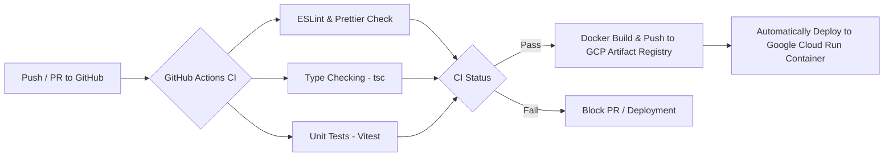
```mermaid
flowchart LR
    A[Push / PR to GitHub] --> B{GitHub Actions CI}
    B --> C[ESLint & Prettier Check]
    B --> D[Type Checking - tsc]
    B --> E[Unit Tests - Vitest]
    C --> F{CI Status}
    D --> F
    E --> F
    F -- Pass --> G[Docker Build & Push to GCP Artifact Registry]
    F -- Fail --> H[Block PR / Deployment]
    G --> I[Automatically Deploy to Google Cloud Run Container]
```

---

## 🛡️ Security Policy & Privacy

SafeWallet implements strict **Zero-Trust** security principles on financial services. 
For detailed threat models and vulnerability reporting, see [SECURITY.md](SECURITY.md).

### Key Security Implementations:
1. **Zero Retention Storage**: Uploaded files (PDFs/Images) are **never stored** on disk or cloud storage. They are processed entirely in memory and garbage collected.
2. **Automated PII Stripping**: Personally Identifiable Information (ID numbers, Emails, Accounts) are scrubbed via Regex before any payload hits Groq LLM.
3. **Data Encryption at Rest**: Any retained OCR data is aggressively encrypted using **AES-256-GCM** before being inserted into PostgreSQL.
4. **Edge-Level Rate Limiting**: Upstash Redis is used to prevent DDoS, abuse, and quota draining on AI endpoints.
5. **Row-Level Security (RLS)**: Cryptographically guarantees that User A cannot fetch the data records of User B.

---

## ⚙️ Local Installation

```bash
# 1. Clone
git clone https://github.com/kazanaruishere-max/SafeWallet.git && cd SafeWallet

# 2. Install dependencies
npm install

# 3. Setup environment
cp .env.example .env.local

# 4. Run
npm run dev
```

Open [http://localhost:3000](http://localhost:3000).

To contribute, please read [CONTRIBUTING.md](CONTRIBUTING.md).

---

## 🧑‍💻 Creator

Built with dedication by **[Kazanaru](https://github.com/kazanaruishere-max)**.

> *"Code is a shield. Technology is a tool for justice."*

## 📜 License

Distributed under the **MIT License**. See [LICENSE](LICENSE) for details.
Copyright © 2026 **Kazanaru.**
