<div align="center">

<br />


<br />
<br />

<h1>🛡️ SafeWallet</h1>
<h3>AI Financial Wellness Platform for Indonesia</h3>

<p>
  <a href="#-bahasa-indonesia">🇮🇩 Bahasa Indonesia</a> · <a href="#-english">🇬🇧 English</a>
</p>

<br />

> [!CAUTION]
> **📢 THIS PROJECT IS A DEMO / PROTOTYPE**
> This application is currently running as a **demonstration prototype** on free-tier **Cloud SaaS** services:
> Supabase (Free), Vercel (Hobby), Upstash Redis (Free), Groq API, and Sentry (Free).
> Capacity, quotas, and performance are strictly limited by each service's free-tier constraints.
> **DO NOT USE FOR PRODUCTION WITH REAL FINANCIAL DATA OR PII.** Upgrade to enterprise/paid tiers before deploying to a high-traffic production environment.

</div>

---

# 🇮🇩 Bahasa Indonesia

## Tentang SafeWallet

SafeWallet adalah platform berbasis AI yang dirancang sebagai antitesis terhadap epidemi investasi bodong, kebrutalan Pinjaman Online (Pinjol), dan rendahnya literasi finansial di Indonesia. Platform ini dirancang dengan pendekatan keamanan tinggi (*Zero-Trust*).

> *"Karena tidak ada yang seharusnya hancur hanya karena ketidaktahuan finansial."*

### Konsep & Fitur Inti

1. **Pembedahan Radikal (Health Scanner)** — Membedah dokumen mutasi rekening bank secara otomatis (via OCR & LLM) untuk mengkategorikan pengeluaran dan menemukan anomali finansial.
2. **Resusitasi Pinjol (Saku Academy Lock)** — Mendeteksi *Debt-to-Income Ratio* (DTI). Jika melampaui 35%, antarmuka akan terkunci dalam mode penyelamatan untuk memandu pengguna keluar dari krisis.
3. **Peringatan Preventif (Scam Checker)** — Menganalisis deskripsi investasi untuk membedah pola Ponzi atau skema piramida seketika menggunakan RAG (Retrieval-Augmented Generation) berbasis data OJK.
4. **AI Pengacara (Legal Generator)** — Generator otomatis untuk dokumen hukum dasar dan somasi perlindungan konsumen.
5. **Data Breach (Kebocoran Data)** — Pemantauan dan peringatan *real-time* jika kredensial atau data pribadi pengguna ditemukan di web gelap atau forum *hacker*.
6. **Bot Telegram** — Memberikan ringkasan, notifikasi pengeluaran, dan *coaching* harian.

### 🌐 Demo Live

| Lingkungan | URL |
|---|---|
| **Production Demo** | [safe-wallet-orpin.vercel.app](https://safe-wallet-orpin.vercel.app) |

---

## 📐 Arsitektur Sistem & Workflow

SafeWallet memiliki arsitektur modular yang terbagi dalam beberapa *pipeline* fitur. Berikut adalah rincian *flowchart* untuk semua fitur utama.

### 1. Arsitektur Utama (High-Level)

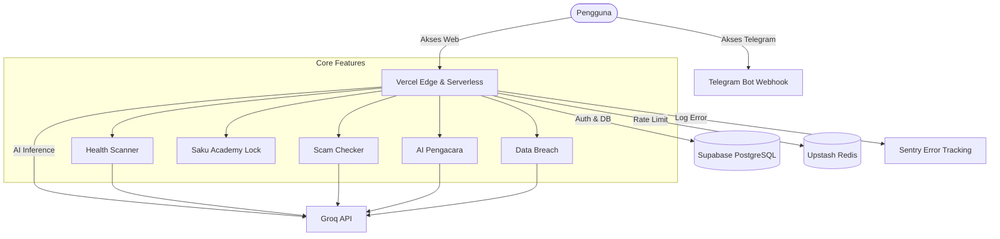
```mermaid
graph TD
    User([Pengguna]) -->|Akses Web| Vercel[Vercel Edge & Serverless]
    User -->|Akses Telegram| TeleBot[Telegram Bot Webhook]

    Vercel -->|Auth & DB| Supabase[(Supabase PostgreSQL)]
    Vercel -->|Rate Limit| Upstash[(Upstash Redis)]
    Vercel -->|AI Inference| Groq[Groq API]
    
    subgraph Core_Features [Core Features]
        Vercel --> Scanner[Health Scanner]
        Vercel --> ScamCheck[Scam Checker]
        Vercel --> SakuAcademy[Saku Academy Lock]
        Vercel --> LegalGen[AI Pengacara]
        Vercel --> Breach[Data Breach]
    end

    Scanner --> Groq
    ScamCheck --> Groq
    LegalGen --> Groq
    Breach --> Groq
    
    Vercel -->|Log Error| Sentry[Sentry Error Tracking]
```

### 2. Workflow: Health Scanner (Upload Mutasi)

Proses pemindaian riwayat keuangan pengguna tanpa menyimpan berkas asli secara permanen.

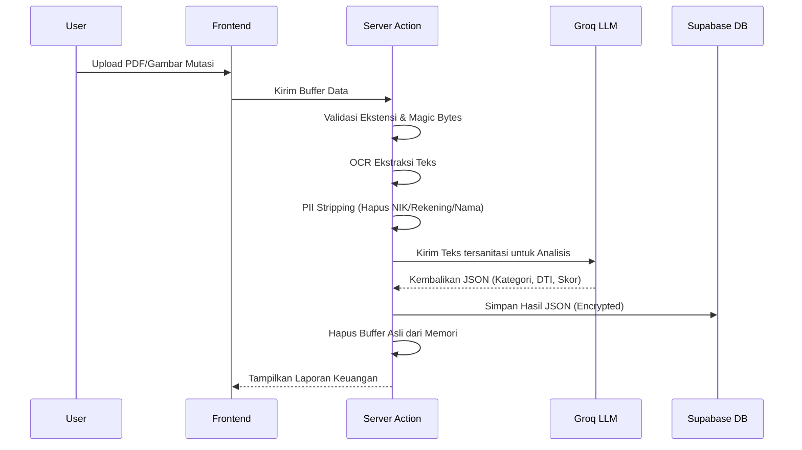
```mermaid
sequenceDiagram
    participant U as User
    participant F as Frontend
    participant S as Server Action
    participant AI as Groq LLM
    participant DB as Supabase DB

    U->>F: Upload PDF/Gambar Mutasi
    F->>S: Kirim Buffer Data
    S->>S: Validasi Ekstensi & Magic Bytes
    S->>S: OCR Ekstraksi Teks
    S->>S: PII Stripping (Hapus NIK/Rekening/Nama)
    S->>AI: Kirim Teks tersanitasi untuk Analisis
    AI-->>S: Kembalikan JSON (Kategori, DTI, Skor)
    S->>DB: Simpan Hasil JSON (Encrypted)
    S->>S: Hapus Buffer Asli dari Memori
    S-->>F: Tampilkan Laporan Keuangan
```

### 3. Workflow: Scam Checker (Deteksi Penipuan)

Memanfaatkan RAG (Retrieval-Augmented Generation) untuk mencocokkan input dengan modus operandi yang dikenal.

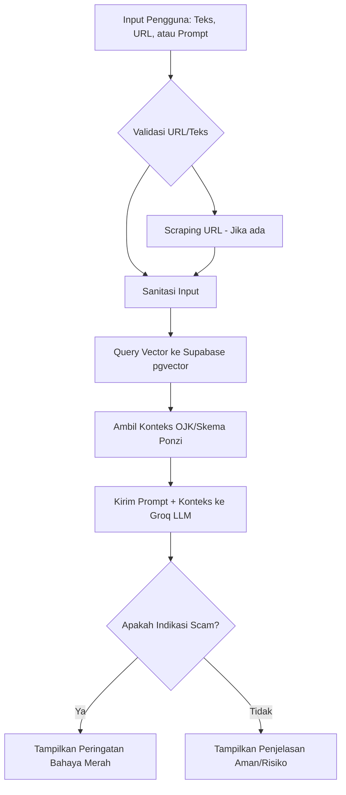
```mermaid
flowchart TD
    A[Input Pengguna: Teks, URL, atau Prompt] --> B{Validasi URL/Teks}
    B --> C[Scraping URL - Jika ada]
    B --> D[Sanitasi Input]
    C --> D
    D --> E[Query Vector ke Supabase pgvector]
    E --> F[Ambil Konteks OJK/Skema Ponzi]
    F --> G[Kirim Prompt + Konteks ke Groq LLM]
    G --> H{Apakah Indikasi Scam?}
    H -- Ya --> I[Tampilkan Peringatan Bahaya Merah]
    H -- Tidak --> J[Tampilkan Penjelasan Aman/Risiko]
```

### 4. Workflow: Saku Academy Lock (Crisis Mode)

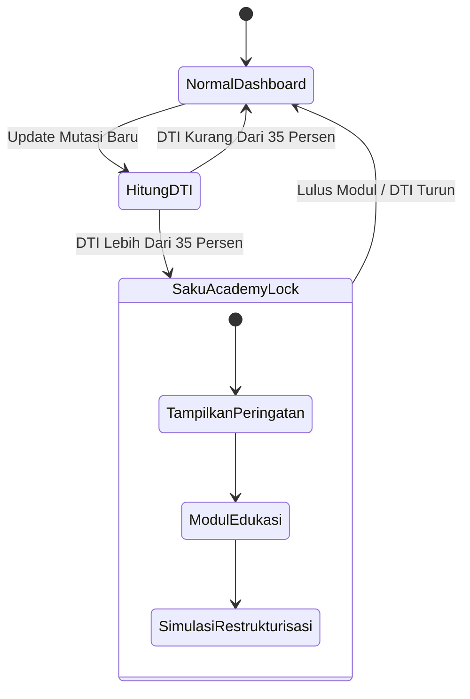
```mermaid
stateDiagram-v2
    [*] --> NormalDashboard
    NormalDashboard --> HitungDTI: Update Mutasi Baru
    HitungDTI --> SakuAcademyLock: DTI Lebih Dari 35 Persen
    HitungDTI --> NormalDashboard: DTI Kurang Dari 35 Persen
    
    state SakuAcademyLock {
        [*] --> TampilkanPeringatan
        TampilkanPeringatan --> ModulEdukasi
        ModulEdukasi --> SimulasiRestrukturisasi
    }
    
    SakuAcademyLock --> NormalDashboard: Lulus Modul / DTI Turun
```

### 5. Workflow: AI Pengacara (Legal Generator)

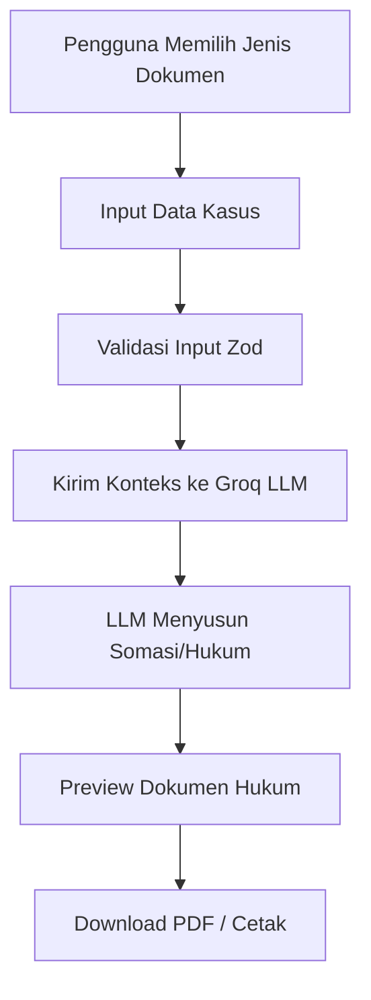
```mermaid
flowchart TD
    A[Pengguna Memilih Jenis Dokumen] --> B[Input Data Kasus]
    B --> C[Validasi Input Zod]
    C --> D[Kirim Konteks ke Groq LLM]
    D --> E[LLM Menyusun Somasi/Hukum]
    E --> F[Preview Dokumen Hukum]
    F --> G[Download PDF / Cetak]
```

### 6. Workflow: Data Breach (Deteksi Kebocoran Data)

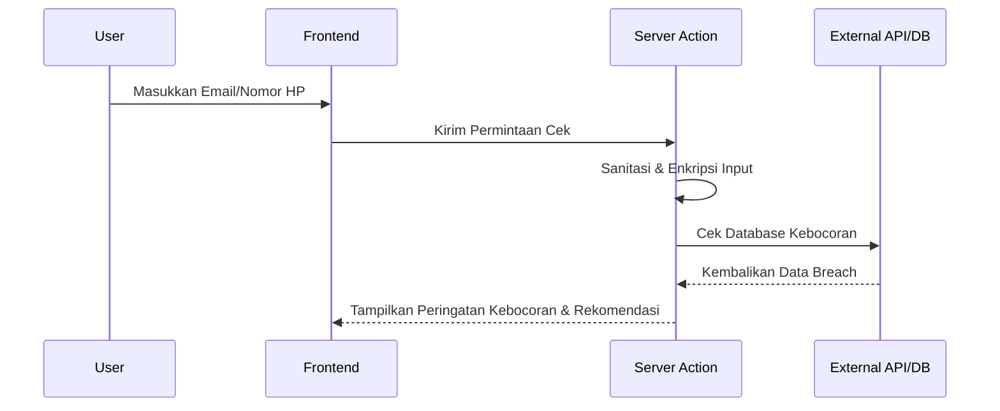
```mermaid
sequenceDiagram
    participant U as User
    participant F as Frontend
    participant S as Server Action
    participant HIBP as External API/DB
    
    U->>F: Masukkan Email/Nomor HP
    F->>S: Kirim Permintaan Cek
    S->>S: Sanitasi & Enkripsi Input
    S->>HIBP: Cek Database Kebocoran
    HIBP-->>S: Kembalikan Data Breach
    S-->>F: Tampilkan Peringatan Kebocoran & Rekomendasi
```

---

## 🛠 CI/CD Pipeline

Proyek ini menggunakan GitHub Actions dan Vercel untuk *Continuous Integration* dan *Continuous Deployment*.

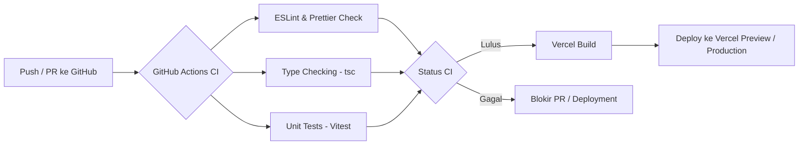
```mermaid
flowchart LR
    A[Push / PR ke GitHub] --> B{GitHub Actions CI}
    B --> C[ESLint & Prettier Check]
    B --> D[Type Checking - tsc]
    B --> E[Unit Tests - Vitest]
    C --> F{Status CI}
    D --> F
    E --> F
    F -- Lulus --> G[Vercel Build]
    F -- Gagal --> H[Blokir PR / Deployment]
    G --> I[Deploy ke Vercel Preview / Production]
```

---

## 🛡️ Keamanan & Privasi (Security Policy)

SafeWallet mengimplementasikan prinsip keamanan **Zero-Trust** pada aplikasi finansial. Rincian lebih lanjut dapat dibaca di [SECURITY.md](SECURITY.md).

### Fokus Utama Keamanan:
1. **Zero Retention (Tidak Ada Penyimpanan Berkas)**: Dokumen PDF/gambar transaksi pengguna **tidak pernah disimpan** di *bucket storage* manapun. Diproses di memori dan langsung dihancurkan (Garbage Collected).
2. **PII Stripping Otomatis**: Data *Personally Identifiable Information* seperti NIK, Nomor Rekening, dan Email disensor menggunakan *Regex* sebelum dikirim ke Groq AI.
3. **Enkripsi Data At Rest**: Teks hasil OCR yang perlu disimpan (jika pengguna mengizinkan riwayat) dienkripsi secara ketat menggunakan **AES-256-GCM** sebelum masuk ke *database* PostgreSQL.
4. **Rate Limiting Edge-Level**: Menggunakan Upstash Redis, kami mencegah serangan DDoS, *brute force*, dan pengurasan kuota AI (AI limit: 5/menit, General limit: 50/menit per IP).
5. **Row-Level Security (RLS)**: Setiap akses ke *database* dijamin melalui Supabase RLS agar pengguna A tidak mungkin dapat membaca *scan_history* milik pengguna B.

---

## ⚙️ Instalasi Lokal

```bash
# 1. Clone
git clone https://github.com/kazanaruishere-max/SafeWallet.git && cd SafeWallet

# 2. Install dependencies
npm install

# 3. Setup environment
cp .env.example .env.local
# Isi kredensial di .env.local

# 4. Jalankan Server Dev
npm run dev
```

Buka [http://localhost:3000](http://localhost:3000).

Untuk berkontribusi, silakan baca [CONTRIBUTING.md](CONTRIBUTING.md).

---

# 🇬🇧 English

## About SafeWallet

SafeWallet is an AI-powered financial wellness platform designed to combat the epidemic of investment fraud, predatory online lending (Pinjol), and low financial literacy in Indonesia. The platform is designed with a high-security approach (Zero-Trust).

> *"Because no one should be destroyed simply by financial ignorance."*

### Core Concepts & Features

1. **Radical Transparency (Health Scanner)** — Automatically dissect bank statement documents via OCR & LLM to categorize spending and find financial anomalies.
2. **Debt-Snowball Rescue (Saku Academy Lock)** — Detects Debt-to-Income Ratio (DTI). If it exceeds 35%, the interface locks into a rescue mode to guide users out of crisis.
3. **Scam Interceptor (Scam Checker)** — Analyzes investment descriptions to dissect Ponzi or pyramid patterns instantly using Retrieval-Augmented Generation (RAG) backed by official OJK data.
4. **AI Lawyer (Legal Generator)** — Automated generator for basic legal documents and consumer protection cease-and-desists.
5. **Data Breach Monitor** — Real-time monitoring and alerts if user credentials or personal data are found on the dark web or hacker forums.
6. **Telegram Bot** — Provides summaries, daily coaching, and expense notifications.

### 🌐 Live Demo

| Environment | URL |
|---|---|
| **Production Demo** | [safe-wallet-orpin.vercel.app](https://safe-wallet-orpin.vercel.app) |

---

## 📐 Architecture & Workflow

SafeWallet has a modular architecture separated into several feature pipelines. Below are detailed flowcharts for major features.

### 1. High-Level Architecture

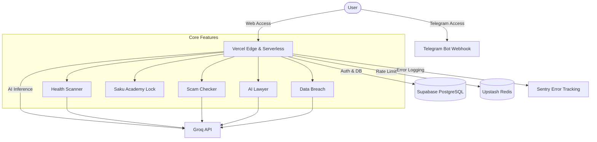
```mermaid
graph TD
    User([User]) -->|Web Access| Vercel[Vercel Edge & Serverless]
    User -->|Telegram Access| TeleBot[Telegram Bot Webhook]

    Vercel -->|Auth & DB| Supabase[(Supabase PostgreSQL)]
    Vercel -->|Rate Limit| Upstash[(Upstash Redis)]
    Vercel -->|AI Inference| Groq[Groq API]
    
    subgraph Core_Features [Core Features]
        Vercel --> Scanner[Health Scanner]
        Vercel --> ScamCheck[Scam Checker]
        Vercel --> SakuAcademy[Saku Academy Lock]
        Vercel --> LegalGen[AI Lawyer]
        Vercel --> Breach[Data Breach]
    end

    Scanner --> Groq
    ScamCheck --> Groq
    LegalGen --> Groq
    Breach --> Groq
    
    Vercel -->|Error Logging| Sentry[Sentry Error Tracking]
```

### 2. Workflow: Health Scanner (Statement Upload)

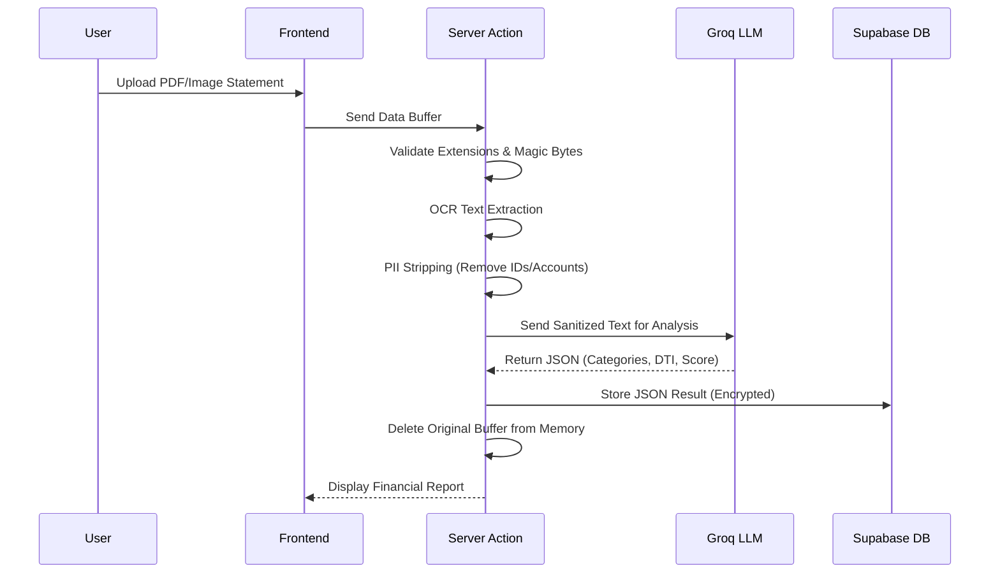
```mermaid
sequenceDiagram
    participant U as User
    participant F as Frontend
    participant S as Server Action
    participant AI as Groq LLM
    participant DB as Supabase DB

    U->>F: Upload PDF/Image Statement
    F->>S: Send Data Buffer
    S->>S: Validate Extensions & Magic Bytes
    S->>S: OCR Text Extraction
    S->>S: PII Stripping (Remove IDs/Accounts)
    S->>AI: Send Sanitized Text for Analysis
    AI-->>S: Return JSON (Categories, DTI, Score)
    S->>DB: Store JSON Result (Encrypted)
    S->>S: Delete Original Buffer from Memory
    S-->>F: Display Financial Report
```

### 3. Workflow: AI Lawyer (Legal Generator)

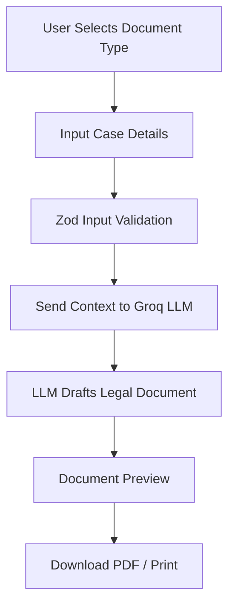
```mermaid
flowchart TD
    A[User Selects Document Type] --> B[Input Case Details]
    B --> C[Zod Input Validation]
    C --> D[Send Context to Groq LLM]
    D --> E[LLM Drafts Legal Document]
    E --> F[Document Preview]
    F --> G[Download PDF / Print]
```

### 4. Workflow: Data Breach Monitor

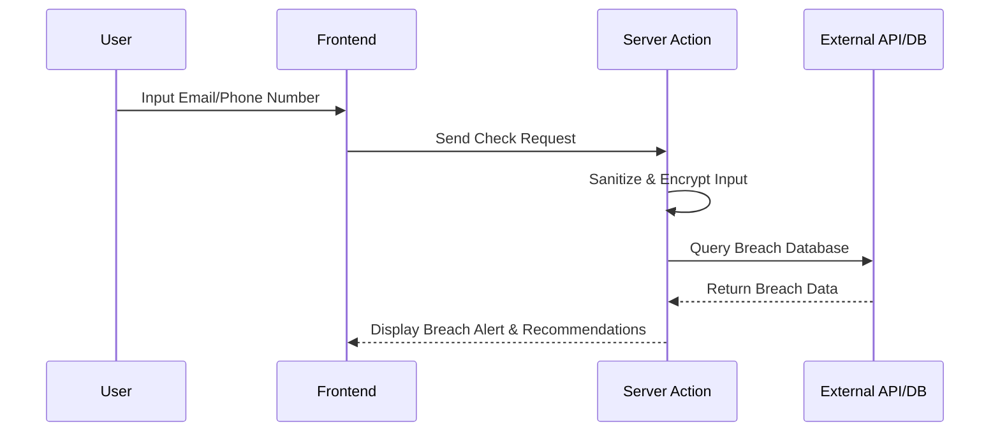
```mermaid
sequenceDiagram
    participant U as User
    participant F as Frontend
    participant S as Server Action
    participant HIBP as External API/DB
    
    U->>F: Input Email/Phone Number
    F->>S: Send Check Request
    S->>S: Sanitize & Encrypt Input
    S->>HIBP: Query Breach Database
    HIBP-->>S: Return Breach Data
    S-->>F: Display Breach Alert & Recommendations
```

### 5. Workflow: CI/CD Pipeline

We utilize GitHub Actions and Vercel for our deployment pipeline.

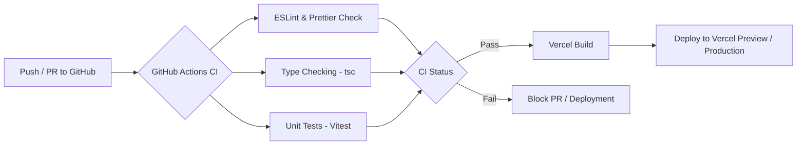
```mermaid
flowchart LR
    A[Push / PR to GitHub] --> B{GitHub Actions CI}
    B --> C[ESLint & Prettier Check]
    B --> D[Type Checking - tsc]
    B --> E[Unit Tests - Vitest]
    C --> F{CI Status}
    D --> F
    E --> F
    F -- Pass --> G[Vercel Build]
    F -- Fail --> H[Block PR / Deployment]
    G --> I[Deploy to Vercel Preview / Production]
```

---

## 🛡️ Security Policy & Privacy

SafeWallet implements strict **Zero-Trust** security principles. 
For detailed threat models and vulnerability reporting, see [SECURITY.md](SECURITY.md).

### Key Security Implementations:
1. **Zero Retention Storage**: Uploaded files (PDFs/Images) are **never stored** on disk or cloud storage. They are processed entirely in memory and garbage collected.
2. **Automated PII Stripping**: Personally Identifiable Information (ID numbers, Emails, Accounts) are scrubbed via Regex before any payload hits Groq LLM.
3. **Data Encryption at Rest**: Any retained OCR data is aggressively encrypted using **AES-256-GCM** before being inserted into PostgreSQL.
4. **Edge-Level Rate Limiting**: Upstash Redis is used to prevent DDoS, abuse, and quota draining on AI endpoints.
5. **Row-Level Security (RLS)**: Cryptographically guarantees that User A cannot fetch the data records of User B.

---

## ⚙️ Local Installation

```bash
# 1. Clone
git clone https://github.com/kazanaruishere-max/SafeWallet.git && cd SafeWallet

# 2. Install dependencies
npm install

# 3. Setup environment
cp .env.example .env.local

# 4. Run
npm run dev
```

Open [http://localhost:3000](http://localhost:3000).

To contribute, please read [CONTRIBUTING.md](CONTRIBUTING.md).

---

## 🧑‍💻 Creator

Built with dedication by **[Kazanaru](https://github.com/kazanaruishere-max)**.

> *"Code is a shield. Technology is a tool for justice."*

## 📜 License

Distributed under the **MIT License**. See [LICENSE](LICENSE) for details.
Copyright © 2026 **Kazanaru.**
