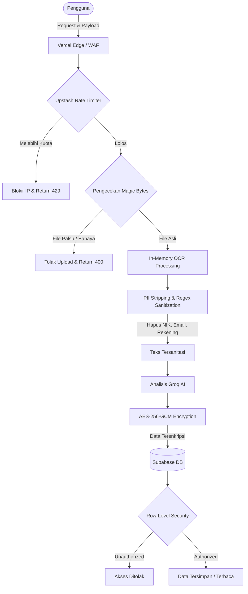

# Security Policy (Kebijakan Keamanan)

Keamanan adalah pilar utama dari aplikasi SafeWallet, mengingat ketatnya pembatasan Anti-Pencucian Uang (AML) dan Pelindungan Data Pribadi (PDP) di Indonesia. Dokumen ini menguraikan arsitektur keamanan, model ancaman (Threat Model), dan prosedur pelaporan kerentanan.

## Supported Versions

SafeWallet secara berkesinambungan memantau kerentanan pada *build* utama di Vercel *deployment*. Kami memprioritaskan keamanan instans yang memegang *Personally Identifiable Information* (PII) dan metadata finansial yang sangat sensitif.

| Version | Supported          |
| ------- | ------------------ |
| v0.1.0+ | :white_check_mark: |
| < v0.1.0| :x:                |

---

## Arsitektur Keamanan Terperinci

### Workflow Sistem Keamanan (Security Pipeline)

Berikut adalah bagaimana lapisan keamanan SafeWallet bekerja memproses permintaan dari pengguna hingga ke penyimpanan:

### 1. Prinsip Zero-Trust & Zero Retention
- **Dokumen Tidak Pernah Disimpan**: Berkas PDF atau gambar transaksi mutasi yang diunggah pengguna **TIDAK PERNAH** disimpan di *storage bucket* (AWS S3, Supabase Storage, dll).
- Pemrosesan OCR terjadi secara komputasi di memori (*in-memory processing*). Setelah teks berhasil diekstraksi, *buffer* berkas langsung dihancurkan oleh *Garbage Collector* Vercel/Node.js.

### 2. PII Stripping (Sanitasi Data Pribadi)
Sebelum teks mutasi dikirimkan ke model Groq LLM untuk dianalisis, *pipeline* server menggunakan filter berbasis Regex untuk menghapus secara agresif:
- Nomor Induk Kependudukan (NIK)
- Alamat Email
- Nomor Rekening Bank
- Nama lengkap (berdasarkan *Named Entity Recognition* ringan)

AI hanya menerima teks finansial mentah seperti: `"TRANSFER KE BCA XXXXXX2345 Rp500.000"`.

### 3. Enkripsi Data At Rest (AES-256-GCM)
Jika pengguna memilih untuk menyimpan riwayat analisis (*scan history*), data OCR yang tersisa akan dienkripsi dengan standar militer **AES-256-GCM** sebelum masuk ke *database* PostgreSQL.
Kunci enkripsi dikelola secara terpisah melalui Environment Variable `ENCRYPTION_KEY` dan tidak tersimpan di *database*.

### 4. Supabase Row-Level Security (RLS)
Semua tabel di Supabase diikat oleh *RLS Policies* kriptografis berdasarkan ID Autentikasi Pengguna (`auth.uid()`).
- Seorang pengguna, meskipun mencoba injeksi API, tidak memiliki izin (*permission*) tingkat PostgreSQL untuk melakukan `SELECT`, `UPDATE`, atau `DELETE` pada baris data milik pengguna lain.

---

## Threat Model & Protections (Analisis Model Ancaman)

Kami telah memetakan vektor serangan utama dan mitigasi yang kami terapkan:

| Jenis Ancaman (Threat) | Dampak | Perlindungan SafeWallet (Mitigasi) |
|---|---|---|
| **Malicious File Upload** (Shell/RCE) | Pengambilalihan Server | Analisis *Magic Bytes* (memastikan berkas benar-benar PDF/PNG, bukan eksistensi semu). Beban kerja terjadi di *sandbox serverless* ephemeral. |
| **DDoS / Kuota AI Draining** | Aplikasi Mati / Tagihan API Meledak | Upstash Redis **Rate Limiting** (AI calls dibatasi maksimal 5/menit/IP, General API 50/menit/IP). |
| **XSS via Input Teks / Telegram** | Eksekusi Skrip Berbahaya | Input sanitasi menggunakan `Zod`, *React DOM escaping*, dan implementasi **Content Security Policy (CSP)** yang ketat via Header Vercel. |
| **IDOR (Insecure Direct Object Ref)** | Akses Data Pengguna Lain | Ditangkal secara matematis di *layer database* oleh Supabase RLS. |
| **Data Leak (Database Compromise)** | Kebocoran Riwayat Transaksi | Bahkan jika penyerang mencuri *dump* PostgreSQL, teks OCR tetap terenkripsi AES-256-GCM tanpa kunci deskripsi. |

---

## Auditing & Monitoring

Semua aksi sensitif pengguna (seperti *login*, penghapusan data, deteksi *scam* berisiko tinggi) dicatat dalam tabel `audit_logs` internal dengan menyimpan:
- Jenis Aksi (Action Type)
- Timestamp
- IP Address (di-hash parsial)
- User Agent

Kami juga menggunakan **Sentry** untuk menangkap setiap anomali pemrosesan di *backend* agar tim dapat segera memperbaiki *bug* sebelum dieksploitasi.

---

## Reporting a Vulnerability (Pelaporan Kerentanan)

Jika Anda menemukan celah atau *loophole* keamanan, harap ikuti protokol **Coordinated Vulnerability Disclosure (CVD)** kami:

1. **JANGAN PERNAH** membuka isu publik (GitHub Issue) untuk kerentanan keamanan.
2. Silakan kirim email langsung ke `security@safewallet.id` (atau langsung ke pengembang utama) dengan rincian berikut:
  - Deskripsi celah atau kerentanan.
  - *Environment* yang diperlukan untuk mereplikasi.
  - Langkah demi langkah (*step-by-step*) instruksi reproduksi.
  - Perkiraan keparahan (*severity/payload*) berdasarkan skala CWSS/CVSS.

### Batasan Kritis (P0)
Setiap kerentanan yang mengizinkan *bypass* dari **Magic Byte Checker** pada `app/api/scan/route.ts` atau **bypasses Supabase RLS** sehingga pengguna A bisa membaca riwayat pengguna B akan dikategorikan sebagai **P0 (Critical)**.

### Response Time
Kami akan mengonfirmasi penerimaan laporan Anda dalam waktu **72 jam** dan berusaha memberikan pembaruan rutin terkait proses *patch*. Jika kerentanan divalidasi, kami akan melakukan *deploy* perbaikan *hotfix* ke *branch* produksi secepat mungkin, diikuti oleh rilis Laporan Insiden via GitHub Advisories.
